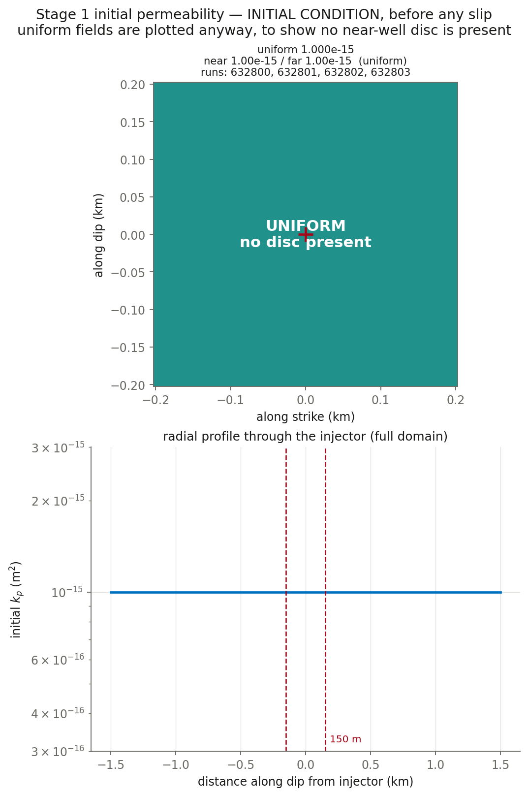

# Stage 1 — res1807/res1808 physics on fixed HBI, uniform initial perm

**Nothing here has been submitted.** This is the pre-submittal check.

## Decks

| run | parent | eta Pa·s | beta 1/Pa | phi | phi*beta | kpmax | kp=kpmin | perm field | muinit | tau0 MPa | dp_crit MPa | tmax d |
|---|---|---|---|---|---|---|---|---|---|---|---|---|
| [632800](params_632800.txt) | 1807 | 0.89e-3 | 2.25e-8 | 0.01 | 2.250e-10 | 2.5e-13 | 1e-15 | uniform | 0.37 | 11.10 | 11.50 | 5.00 |
| [632801](params_632801.txt) | 1807 | 1.27e-4 | 1.5768e-07 | 0.01 | 1.577e-09 | 2.5e-13 | 1e-15 | uniform | 0.37 | 11.10 | 11.50 | 5.00 |
| [632802](params_632802.txt) | 1808 | 0.89e-3 | 2.005e-8 | 0.01 | 2.005e-10 | 5e-14 | 1e-15 | uniform | 0.37 | 11.10 | 11.50 | 5.00 |
| [632803](params_632803.txt) | 1808 | 1.27e-4 | 1.4051e-07 | 0.01 | 1.405e-09 | 5e-14 | 1e-15 | uniform | 0.37 | 11.10 | 11.50 | 5.00 |

## Derived hydraulics

| run | D near m²/s | D far m²/s | str=beta*phi | T at kpmin | T at kpmax | gamma(h=60s, kpmin) | gamma(h=60s, kpmax) |
|---|---|---|---|---|---|---|---|
| 632800 | 4.9938e-03 | 4.9938e-03 | 2.250e-10 | 2.918e-12 | 7.296e-10 | 0.9769 | 0.1446 |
| 632801 | 4.9937e-03 | 4.9937e-03 | 1.577e-09 | 2.045e-11 | 5.113e-09 | 0.8578 | 0.0236 |
| 632802 | 5.6040e-03 | 5.6040e-03 | 2.005e-10 | 2.918e-12 | 1.459e-10 | 0.9769 | 0.4581 |
| 632803 | 5.6039e-03 | 5.6039e-03 | 1.405e-09 | 2.045e-11 | 1.023e-09 | 0.8578 | 0.1076 |

`str`, `T` and `gamma` are the quantities `m_diffusion.f90` actually assembles (lines 444, 669, 671). `gamma` is the one a viscosity/compressibility trade does **not** hold fixed.

## Failure feasibility — can the fault slip at the OBSERVED pressure?

Peak **measured** downhole overpressure over these 5.00 d is **10.92 MPa** (p_wh + rho·g·H − P0, with rho·g·H = 40.0 and P0 = 73.8 MPa). Slip requires Δp > Δp_crit = σ̄₀(1 − μ₀/f₀). If Δp_crit exceeds 10.92 MPa the fault can only slip by **over-pressurising past the measurement**.

| run | μ₀ | Δp_crit MPa | vs measured | verdict |
|---|---|---|---|---|
| 632800 | 0.37 | 11.50 | +0.58 | **CANNOT FAIL** without over-pressurising |
| 632801 | 0.37 | 11.50 | +0.58 | **CANNOT FAIL** without over-pressurising |
| 632802 | 0.37 | 11.50 | +0.58 | **CANNOT FAIL** without over-pressurising |
| 632803 | 0.37 | 11.50 | +0.58 | **CANNOT FAIL** without over-pressurising |

**Minimum μ₀ for failure at the observed pressure: 0.3816** (τ₀ = 11.45 MPa at σ̄₀ = 30). This is a floor on how understressed the fault can be in *any* model that also matches the pressure — it follows from the data and the friction law alone, with no simulation involved.

So these baselines are expected to slip only by over-pressurising, which is precisely the 1807/1808 behaviour being characterised (their wellhead runs +67% to +280%). The μ₀ sweep in Stage 3 starts at 0.3867, the first value above this floor.

## Initial condition



## Deck diffs against parents

- [`res632800.in` vs `res1807.in`](diff_632800.txt)
- [`res632801.in` vs `res1807.in`](diff_632801.txt)
- [`res632802.in` vs `res1808.in`](diff_632802.txt)
- [`res632803.in` vs `res1808.in`](diff_632803.txt)

## Launch commands, once approved

```bash
cd /home/groups/edunham/nberrios/3dhbi/examples/grid_search_inputs
sbatch march26_submit_hbi_git_scratch.sh -i res632800.in -w june_clean.txt
sbatch march26_submit_hbi_git_scratch.sh -i res632801.in -w june_clean.txt
sbatch march26_submit_hbi_git_scratch.sh -i res632802.in -w june_clean.txt
sbatch march26_submit_hbi_git_scratch.sh -i res632803.in -w june_clean.txt
```
