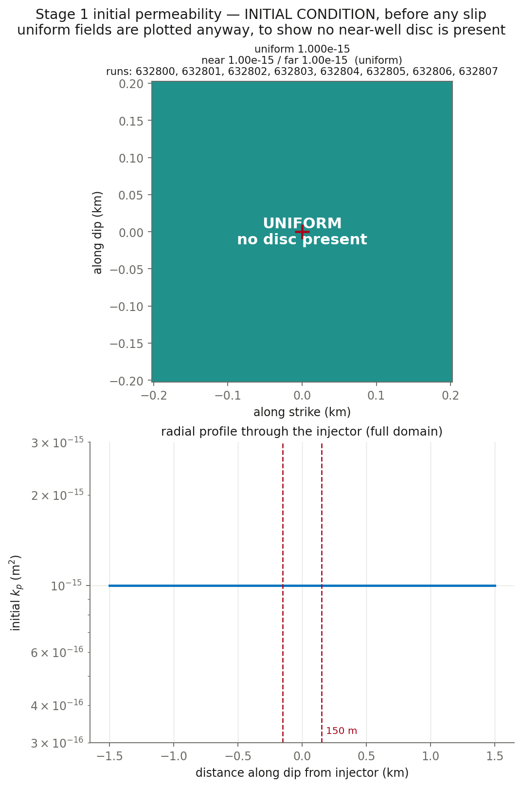

# Stage 1 — res1807/res1808 physics on fixed HBI, uniform initial perm, twinned on sigmabar_0

**Nothing here has been submitted.** This is the pre-submittal check.

## Decks

| run | parent | **permev** | **sigmabar_0** | eta Pa·s | beta 1/Pa | phi | phi*beta | kpmax | kp=kpmin | perm field | injection | muinit | tau0 MPa | dp_crit MPa | tmax d |
|---|---|---|---|---|---|---|---|---|---|---|---|---|---|---|---|
| [632800](params_632800.txt) | 1807 | **T** | **30.0** | 0.89e-3 | 2.25e-8 | 0.01 | 2.250e-10 | 2.5e-13 | 1e-15 | uniform | `june_clean.txt` | 0.37 | 11.10 | 11.50 | 5.00 |
| [632801](params_632801.txt) | 1807 | **T** | **27.99** | 0.89e-3 | 2.25e-8 | 0.01 | 2.250e-10 | 2.5e-13 | 1e-15 | uniform | `june_clean.txt` | 0.37 | 10.36 | 10.73 | 5.00 |
| [632802](params_632802.txt) | 1807 | **T** | **30.0** | 1.27e-4 | 1.5768e-07 | 0.01 | 1.577e-09 | 2.5e-13 | 1e-15 | uniform | `june_clean.txt` | 0.37 | 11.10 | 11.50 | 5.00 |
| [632803](params_632803.txt) | 1807 | **T** | **27.99** | 1.27e-4 | 1.5768e-07 | 0.01 | 1.577e-09 | 2.5e-13 | 1e-15 | uniform | `june_clean.txt` | 0.37 | 10.36 | 10.73 | 5.00 |
| [632804](params_632804.txt) | 1808 | **T** | **30.0** | 0.89e-3 | 2.005e-8 | 0.01 | 2.005e-10 | 5e-14 | 1e-15 | uniform | `june_clean.txt` | 0.37 | 11.10 | 11.50 | 5.00 |
| [632805](params_632805.txt) | 1808 | **T** | **27.99** | 0.89e-3 | 2.005e-8 | 0.01 | 2.005e-10 | 5e-14 | 1e-15 | uniform | `june_clean.txt` | 0.37 | 10.36 | 10.73 | 5.00 |
| [632806](params_632806.txt) | 1808 | **T** | **30.0** | 1.27e-4 | 1.4051e-07 | 0.01 | 1.405e-09 | 5e-14 | 1e-15 | uniform | `june_clean.txt` | 0.37 | 11.10 | 11.50 | 5.00 |
| [632807](params_632807.txt) | 1808 | **T** | **27.99** | 1.27e-4 | 1.4051e-07 | 0.01 | 1.405e-09 | 5e-14 | 1e-15 | uniform | `june_clean.txt` | 0.37 | 10.36 | 10.73 | 5.00 |

## Derived hydraulics

| run | D near m²/s | D far m²/s | str=beta*phi | T at kpmin | T at kpmax | gamma(h=60s, kpmin) | gamma(h=60s, kpmax) |
|---|---|---|---|---|---|---|---|
| 632800 | 4.9938e-03 | 4.9938e-03 | 2.250e-10 | 2.918e-12 | 7.296e-10 | 0.9769 | 0.1446 |
| 632801 | 4.9938e-03 | 4.9938e-03 | 2.250e-10 | 2.918e-12 | 7.296e-10 | 0.9769 | 0.1446 |
| 632802 | 4.9937e-03 | 4.9937e-03 | 1.577e-09 | 2.045e-11 | 5.113e-09 | 0.8578 | 0.0236 |
| 632803 | 4.9937e-03 | 4.9937e-03 | 1.577e-09 | 2.045e-11 | 5.113e-09 | 0.8578 | 0.0236 |
| 632804 | 5.6040e-03 | 5.6040e-03 | 2.005e-10 | 2.918e-12 | 1.459e-10 | 0.9769 | 0.4581 |
| 632805 | 5.6040e-03 | 5.6040e-03 | 2.005e-10 | 2.918e-12 | 1.459e-10 | 0.9769 | 0.4581 |
| 632806 | 5.6039e-03 | 5.6039e-03 | 1.405e-09 | 2.045e-11 | 1.023e-09 | 0.8578 | 0.1076 |
| 632807 | 5.6039e-03 | 5.6039e-03 | 1.405e-09 | 2.045e-11 | 1.023e-09 | 0.8578 | 0.1076 |

`str`, `T` and `gamma` are the quantities `m_diffusion.f90` actually assembles (lines 444, 669, 671). `gamma` is the one a viscosity/compressibility trade does **not** hold fixed.

## Failure feasibility — can the fault slip at the OBSERVED pressure?

Peak **measured** downhole overpressure over these 5.00 d is **10.92 MPa** (p_wh + rho·g·H − P0, with rho·g·H = 40.0 and P0 = 73.8 MPa). Slip requires Δp > Δp_crit = σ̄₀(1 − μ₀/f₀). If Δp_crit exceeds 10.92 MPa the fault can only slip by **over-pressurising past the measurement**.

| run | μ₀ | Δp_crit MPa | vs measured | verdict |
|---|---|---|---|---|
| 632800 | 0.37 | 11.50 | +0.58 | **CANNOT FAIL** without over-pressurising |
| 632801 | 0.37 | 10.73 | -0.19 | can fail |
| 632802 | 0.37 | 11.50 | +0.58 | **CANNOT FAIL** without over-pressurising |
| 632803 | 0.37 | 10.73 | -0.19 | can fail |
| 632804 | 0.37 | 11.50 | +0.58 | **CANNOT FAIL** without over-pressurising |
| 632805 | 0.37 | 10.73 | -0.19 | can fail |
| 632806 | 0.37 | 11.50 | +0.58 | **CANNOT FAIL** without over-pressurising |
| 632807 | 0.37 | 10.73 | -0.19 | can fail |

**How understressed can the fault be and still fail at the observed pressure?** μ₀ ≥ f₀(1 − Δp_obs/σ̄₀):

| σ̄₀ MPa | minimum μ₀ | minimum τ₀ MPa | source of σ̄₀ |
|---|---|---|---|
| 30 | **0.3816** | **11.45** | res1807/res1808's own value — a round number, **not** a measurement |
| 27.99 | **0.3659** | **10.24** | derived from σ_v 100, σ_Hmax 160, dip 10°, p_pore 73.82 |

So σ̄₀ = 27.99 admits a fault **1.21 MPa more understressed** than σ̄₀ = 30 does (10.24 vs 11.45 MPa). Both floors follow from the wellhead record and the friction law alone, with no simulation involved. The lower σ̄₀ is also the measurement-derived one, so it is both the more defensible choice and the more permissive one.

The μ₀ = 0.37 runs at σ̄₀ = 30.0 are therefore expected to slip only by over-pressurising — which is precisely the 1807/1808 behaviour being characterised (their wellhead runs +67% to +280%). Their σ̄₀ = 27.99 twins sit just below the threshold and should be able to slip at the observed pressure, by 0.19 MPa. That margin is thin enough that the twins may differ qualitatively, not just quantitatively.

## Initial condition



## Deck diffs against parents

- [`res632800.in` vs `res1807.in`](diff_632800.txt)
- [`res632801.in` vs `res1807.in`](diff_632801.txt)
- [`res632802.in` vs `res1807.in`](diff_632802.txt)
- [`res632803.in` vs `res1807.in`](diff_632803.txt)
- [`res632804.in` vs `res1808.in`](diff_632804.txt)
- [`res632805.in` vs `res1808.in`](diff_632805.txt)
- [`res632806.in` vs `res1808.in`](diff_632806.txt)
- [`res632807.in` vs `res1808.in`](diff_632807.txt)

## Launch commands, once approved

```bash
cd /home/groups/edunham/nberrios/3dhbi/examples/grid_search_inputs
sbatch march26_submit_hbi_git_scratch.sh -i res632800.in -w june_clean.txt
sbatch march26_submit_hbi_git_scratch.sh -i res632801.in -w june_clean.txt
sbatch march26_submit_hbi_git_scratch.sh -i res632802.in -w june_clean.txt
sbatch march26_submit_hbi_git_scratch.sh -i res632803.in -w june_clean.txt
sbatch march26_submit_hbi_git_scratch.sh -i res632804.in -w june_clean.txt
sbatch march26_submit_hbi_git_scratch.sh -i res632805.in -w june_clean.txt
sbatch march26_submit_hbi_git_scratch.sh -i res632806.in -w june_clean.txt
sbatch march26_submit_hbi_git_scratch.sh -i res632807.in -w june_clean.txt
```
