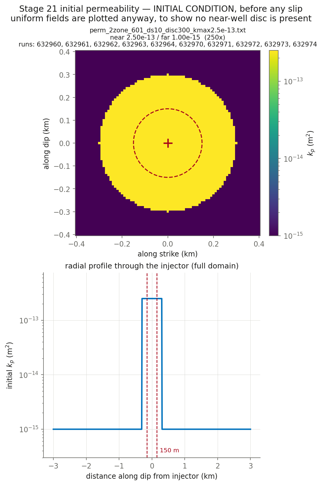

# CYCLE 2 fluid arms — 632960-4 correct the viscosity to eta = 1.27e-4 (one key vs 632950-4); 632970-4 then D-match with beta = 1.5768e-7 (one key vs 632960-4). Three-arm A/B/C on the fluid at fixed muinit sweep (10 runs)

**Nothing here has been submitted.** This is the pre-submittal check.

## Decks

| run | parent | **permev** | **sigmabar_0** | eta Pa·s | beta 1/Pa | phi | phi*beta | kpmax | kp=kpmin | perm field | injection | muinit | tau0 MPa | dp_crit MPa | tmax d |
|---|---|---|---|---|---|---|---|---|---|---|---|---|---|---|---|
| [632960](params_632960.txt) | 632950 | **T** | **27.99** | 1.27e-4 | 2.25e-8 | 0.01 | 2.250e-10 | 2.5e-13 | 1e-15 | perm_2zone_601_ds10_disc300_kmax2.5e-13.txt (250x) | `june_clean_from_d4300.txt` | 0.3700 | 10.36 | 10.73 | 13.10 |
| [632961](params_632961.txt) | 632951 | **T** | **27.99** | 1.27e-4 | 2.25e-8 | 0.01 | 2.250e-10 | 2.5e-13 | 1e-15 | perm_2zone_601_ds10_disc300_kmax2.5e-13.txt (250x) | `june_clean_from_d4300.txt` | 0.4120 | 11.53 | 8.77 | 13.10 |
| [632962](params_632962.txt) | 632952 | **T** | **27.99** | 1.27e-4 | 2.25e-8 | 0.01 | 2.250e-10 | 2.5e-13 | 1e-15 | perm_2zone_601_ds10_disc300_kmax2.5e-13.txt (250x) | `june_clean_from_d4300.txt` | 0.4540 | 12.71 | 6.81 | 13.10 |
| [632963](params_632963.txt) | 632953 | **T** | **27.99** | 1.27e-4 | 2.25e-8 | 0.01 | 2.250e-10 | 2.5e-13 | 1e-15 | perm_2zone_601_ds10_disc300_kmax2.5e-13.txt (250x) | `june_clean_from_d4300.txt` | 0.4950 | 13.86 | 4.90 | 13.10 |
| [632964](params_632964.txt) | 632954 | **T** | **27.99** | 1.27e-4 | 2.25e-8 | 0.01 | 2.250e-10 | 2.5e-13 | 1e-15 | perm_2zone_601_ds10_disc300_kmax2.5e-13.txt (250x) | `june_clean_from_d4300.txt` | 0.5360 | 15.00 | 2.99 | 13.10 |
| [632970](params_632970.txt) | 632960 | **T** | **27.99** | 1.27e-4 | 1.5768e-7 | 0.01 | 1.577e-09 | 2.5e-13 | 1e-15 | perm_2zone_601_ds10_disc300_kmax2.5e-13.txt (250x) | `june_clean_from_d4300.txt` | 0.3700 | 10.36 | 10.73 | 13.10 |
| [632971](params_632971.txt) | 632961 | **T** | **27.99** | 1.27e-4 | 1.5768e-7 | 0.01 | 1.577e-09 | 2.5e-13 | 1e-15 | perm_2zone_601_ds10_disc300_kmax2.5e-13.txt (250x) | `june_clean_from_d4300.txt` | 0.4120 | 11.53 | 8.77 | 13.10 |
| [632972](params_632972.txt) | 632962 | **T** | **27.99** | 1.27e-4 | 1.5768e-7 | 0.01 | 1.577e-09 | 2.5e-13 | 1e-15 | perm_2zone_601_ds10_disc300_kmax2.5e-13.txt (250x) | `june_clean_from_d4300.txt` | 0.4540 | 12.71 | 6.81 | 13.10 |
| [632973](params_632973.txt) | 632963 | **T** | **27.99** | 1.27e-4 | 1.5768e-7 | 0.01 | 1.577e-09 | 2.5e-13 | 1e-15 | perm_2zone_601_ds10_disc300_kmax2.5e-13.txt (250x) | `june_clean_from_d4300.txt` | 0.4950 | 13.86 | 4.90 | 13.10 |
| [632974](params_632974.txt) | 632964 | **T** | **27.99** | 1.27e-4 | 1.5768e-7 | 0.01 | 1.577e-09 | 2.5e-13 | 1e-15 | perm_2zone_601_ds10_disc300_kmax2.5e-13.txt (250x) | `june_clean_from_d4300.txt` | 0.5360 | 15.00 | 2.99 | 13.10 |

## Derived hydraulics

| run | D near m²/s | D far m²/s | str=beta*phi | T at kpmin | T at kpmax | gamma(h=60s, kpmin) | gamma(h=60s, kpmax) |
|---|---|---|---|---|---|---|---|
| 632960 | 8.7489e+00 | 3.4996e-02 | 2.250e-10 | 1.590e-11 | 3.974e-09 | 0.8858 | 0.0301 |
| 632961 | 8.7489e+00 | 3.4996e-02 | 2.250e-10 | 1.590e-11 | 3.974e-09 | 0.8858 | 0.0301 |
| 632962 | 8.7489e+00 | 3.4996e-02 | 2.250e-10 | 1.590e-11 | 3.974e-09 | 0.8858 | 0.0301 |
| 632963 | 8.7489e+00 | 3.4996e-02 | 2.250e-10 | 1.590e-11 | 3.974e-09 | 0.8858 | 0.0301 |
| 632964 | 8.7489e+00 | 3.4996e-02 | 2.250e-10 | 1.590e-11 | 3.974e-09 | 0.8858 | 0.0301 |
| 632970 | 1.2484e+00 | 4.9937e-03 | 1.577e-09 | 1.590e-11 | 3.974e-09 | 0.8858 | 0.0301 |
| 632971 | 1.2484e+00 | 4.9937e-03 | 1.577e-09 | 1.590e-11 | 3.974e-09 | 0.8858 | 0.0301 |
| 632972 | 1.2484e+00 | 4.9937e-03 | 1.577e-09 | 1.590e-11 | 3.974e-09 | 0.8858 | 0.0301 |
| 632973 | 1.2484e+00 | 4.9937e-03 | 1.577e-09 | 1.590e-11 | 3.974e-09 | 0.8858 | 0.0301 |
| 632974 | 1.2484e+00 | 4.9937e-03 | 1.577e-09 | 1.590e-11 | 3.974e-09 | 0.8858 | 0.0301 |

`str`, `T` and `gamma` are the quantities `m_diffusion.f90` actually assembles (lines 444, 669, 671). `gamma` is the one a viscosity/compressibility trade does **not** hold fixed.

## Failure feasibility — can the fault slip at the OBSERVED pressure?

Peak **measured** downhole overpressure over these 13.10 d is **11.84 MPa** (p_wh + rho·g·H − P0, with rho·g·H = 40.0 and P0 = 73.8 MPa). Slip requires Δp > Δp_crit = σ̄₀(1 − μ₀/f₀). If Δp_crit exceeds 11.84 MPa the fault can only slip by **over-pressurising past the measurement**.

| run | μ₀ | Δp_crit MPa | vs measured | verdict |
|---|---|---|---|---|
| 632960 | 0.3700 | 10.73 | -1.11 | can fail |
| 632961 | 0.4120 | 8.77 | -3.07 | can fail |
| 632962 | 0.4540 | 6.81 | -5.03 | can fail |
| 632963 | 0.4950 | 4.90 | -6.94 | can fail |
| 632964 | 0.5360 | 2.99 | -8.85 | can fail |
| 632970 | 0.3700 | 10.73 | -1.11 | can fail |
| 632971 | 0.4120 | 8.77 | -3.07 | can fail |
| 632972 | 0.4540 | 6.81 | -5.03 | can fail |
| 632973 | 0.4950 | 4.90 | -6.94 | can fail |
| 632974 | 0.5360 | 2.99 | -8.85 | can fail |

**How understressed can the fault be and still fail at the observed pressure?** μ₀ ≥ f₀(1 − Δp_obs/σ̄₀):

| σ̄₀ MPa | minimum μ₀ | minimum τ₀ MPa | source of σ̄₀ |
|---|---|---|---|
| 27.99 | **0.3462** | **9.69** | derived from σ_v 100, σ_Hmax 160, dip 10°, p_pore 73.82 |

This stage runs μ₀ = 0.3700, 0.4120, 0.4540, 0.4950, 0.5360, comfortably above the floor above, so the fault can reach failure at the measured pressure without over-pressurising. Whether it then accumulates enough slip to build a front is a separate question that the friction law, not this inequality, decides — HBI's regularised rate-and-state law has no failure threshold, so Δp_crit is an orientation number here and not a prediction.

## Initial condition



## Deck diffs against parents

- [`res632960.in` vs `res632950.in`](diff_632960.txt)
- [`res632961.in` vs `res632951.in`](diff_632961.txt)
- [`res632962.in` vs `res632952.in`](diff_632962.txt)
- [`res632963.in` vs `res632953.in`](diff_632963.txt)
- [`res632964.in` vs `res632954.in`](diff_632964.txt)
- [`res632970.in` vs `res632960.in`](diff_632970.txt)
- [`res632971.in` vs `res632961.in`](diff_632971.txt)
- [`res632972.in` vs `res632962.in`](diff_632972.txt)
- [`res632973.in` vs `res632963.in`](diff_632973.txt)
- [`res632974.in` vs `res632964.in`](diff_632974.txt)

## Launch commands, once approved

```bash
cd /home/groups/edunham/nberrios/3dhbi/examples/grid_search_inputs
sbatch march26_submit_hbi_git_scratch.sh -i res632960.in -w june_clean.txt -p perm_2zone_601_ds10_disc300_kmax2.5e-13.txt
sbatch march26_submit_hbi_git_scratch.sh -i res632961.in -w june_clean.txt -p perm_2zone_601_ds10_disc300_kmax2.5e-13.txt
sbatch march26_submit_hbi_git_scratch.sh -i res632962.in -w june_clean.txt -p perm_2zone_601_ds10_disc300_kmax2.5e-13.txt
sbatch march26_submit_hbi_git_scratch.sh -i res632963.in -w june_clean.txt -p perm_2zone_601_ds10_disc300_kmax2.5e-13.txt
sbatch march26_submit_hbi_git_scratch.sh -i res632964.in -w june_clean.txt -p perm_2zone_601_ds10_disc300_kmax2.5e-13.txt
sbatch march26_submit_hbi_git_scratch.sh -i res632970.in -w june_clean.txt -p perm_2zone_601_ds10_disc300_kmax2.5e-13.txt
sbatch march26_submit_hbi_git_scratch.sh -i res632971.in -w june_clean.txt -p perm_2zone_601_ds10_disc300_kmax2.5e-13.txt
sbatch march26_submit_hbi_git_scratch.sh -i res632972.in -w june_clean.txt -p perm_2zone_601_ds10_disc300_kmax2.5e-13.txt
sbatch march26_submit_hbi_git_scratch.sh -i res632973.in -w june_clean.txt -p perm_2zone_601_ds10_disc300_kmax2.5e-13.txt
sbatch march26_submit_hbi_git_scratch.sh -i res632974.in -w june_clean.txt -p perm_2zone_601_ds10_disc300_kmax2.5e-13.txt
```
