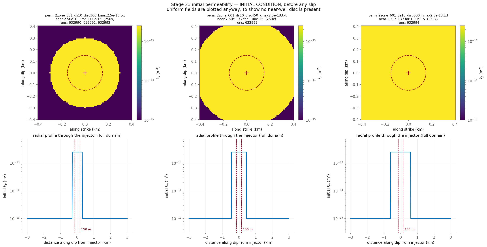

# CYCLE 2 Round 2 — break the front/dp trade-off at the MEASURED tau_0 = 10.36 MPa, where the front already matches at 0.97 and dp is +55%. Round 1 showed front and dp respond to tau_0 with OPPOSITE SIGN, coupled through permev (slip -> kp -> injectivity), so both levers here raise near-well injectivity WITHOUT needing slip: skin -0.5/-1.0/-2.0 (Peaceman well-cell only, front should not move) and the initial high-k disc 450/600 m (not clean -- the front will grow) (5 runs)

**Nothing here has been submitted.** This is the pre-submittal check.

## Decks

| run | parent | **permev** | **sigmabar_0** | eta Pa·s | beta 1/Pa | phi | phi*beta | kpmax | kp=kpmin | perm field | injection | muinit | tau0 MPa | dp_crit MPa | tmax d |
|---|---|---|---|---|---|---|---|---|---|---|---|---|---|---|---|
| [632990](params_632990.txt) | 632960 | **T** | **27.99** | 1.27e-4 | 2.25e-8 | 0.01 | 2.250e-10 | 2.5e-13 | 1e-15 | perm_2zone_601_ds10_disc300_kmax2.5e-13.txt (250x) | `june_clean_from_d4300.txt` | 0.3700 | 10.36 | 10.73 | 13.10 |
| [632991](params_632991.txt) | 632960 | **T** | **27.99** | 1.27e-4 | 2.25e-8 | 0.01 | 2.250e-10 | 2.5e-13 | 1e-15 | perm_2zone_601_ds10_disc300_kmax2.5e-13.txt (250x) | `june_clean_from_d4300.txt` | 0.3700 | 10.36 | 10.73 | 13.10 |
| [632992](params_632992.txt) | 632960 | **T** | **27.99** | 1.27e-4 | 2.25e-8 | 0.01 | 2.250e-10 | 2.5e-13 | 1e-15 | perm_2zone_601_ds10_disc300_kmax2.5e-13.txt (250x) | `june_clean_from_d4300.txt` | 0.3700 | 10.36 | 10.73 | 13.10 |
| [632993](params_632993.txt) | 632960 | **T** | **27.99** | 1.27e-4 | 2.25e-8 | 0.01 | 2.250e-10 | 2.5e-13 | 1e-15 | perm_2zone_601_ds10_disc450_kmax2.5e-13.txt (250x) | `june_clean_from_d4300.txt` | 0.3700 | 10.36 | 10.73 | 13.10 |
| [632994](params_632994.txt) | 632960 | **T** | **27.99** | 1.27e-4 | 2.25e-8 | 0.01 | 2.250e-10 | 2.5e-13 | 1e-15 | perm_2zone_601_ds10_disc600_kmax2.5e-13.txt (250x) | `june_clean_from_d4300.txt` | 0.3700 | 10.36 | 10.73 | 13.10 |

## Derived hydraulics

| run | D near m²/s | D far m²/s | str=beta*phi | T at kpmin | T at kpmax | gamma(h=60s, kpmin) | gamma(h=60s, kpmax) |
|---|---|---|---|---|---|---|---|
| 632990 | 8.7489e+00 | 3.4996e-02 | 2.250e-10 | 1.894e-11 | 4.735e-09 | 0.8669 | 0.0254 |
| 632991 | 8.7489e+00 | 3.4996e-02 | 2.250e-10 | 2.342e-11 | 5.856e-09 | 0.8404 | 0.0206 |
| 632992 | 8.7489e+00 | 3.4996e-02 | 2.250e-10 | 4.448e-11 | 1.112e-08 | 0.7349 | 0.0110 |
| 632993 | 8.7489e+00 | 3.4996e-02 | 2.250e-10 | 1.590e-11 | 3.974e-09 | 0.8858 | 0.0301 |
| 632994 | 8.7489e+00 | 3.4996e-02 | 2.250e-10 | 1.590e-11 | 3.974e-09 | 0.8858 | 0.0301 |

`str`, `T` and `gamma` are the quantities `m_diffusion.f90` actually assembles (lines 444, 669, 671). `gamma` is the one a viscosity/compressibility trade does **not** hold fixed.

## Failure feasibility — can the fault slip at the OBSERVED pressure?

Peak **measured** downhole overpressure over these 13.10 d is **11.84 MPa** (p_wh + rho·g·H − P0, with rho·g·H = 40.0 and P0 = 73.8 MPa). Slip requires Δp > Δp_crit = σ̄₀(1 − μ₀/f₀). If Δp_crit exceeds 11.84 MPa the fault can only slip by **over-pressurising past the measurement**.

| run | μ₀ | Δp_crit MPa | vs measured | verdict |
|---|---|---|---|---|
| 632990 | 0.3700 | 10.73 | -1.11 | can fail |
| 632991 | 0.3700 | 10.73 | -1.11 | can fail |
| 632992 | 0.3700 | 10.73 | -1.11 | can fail |
| 632993 | 0.3700 | 10.73 | -1.11 | can fail |
| 632994 | 0.3700 | 10.73 | -1.11 | can fail |

**How understressed can the fault be and still fail at the observed pressure?** μ₀ ≥ f₀(1 − Δp_obs/σ̄₀):

| σ̄₀ MPa | minimum μ₀ | minimum τ₀ MPa | source of σ̄₀ |
|---|---|---|---|
| 27.99 | **0.3462** | **9.69** | derived from σ_v 100, σ_Hmax 160, dip 10°, p_pore 73.82 |

This stage runs μ₀ = 0.3700, comfortably above the floor above, so the fault can reach failure at the measured pressure without over-pressurising. Whether it then accumulates enough slip to build a front is a separate question that the friction law, not this inequality, decides — HBI's regularised rate-and-state law has no failure threshold, so Δp_crit is an orientation number here and not a prediction.

## Initial condition



## Deck diffs against parents

- [`res632990.in` vs `res632960.in`](diff_632990.txt)
- [`res632991.in` vs `res632960.in`](diff_632991.txt)
- [`res632992.in` vs `res632960.in`](diff_632992.txt)
- [`res632993.in` vs `res632960.in`](diff_632993.txt)
- [`res632994.in` vs `res632960.in`](diff_632994.txt)

## Launch commands, once approved

```bash
cd /home/groups/edunham/nberrios/3dhbi/examples/grid_search_inputs
sbatch march26_submit_hbi_git_scratch.sh -i res632990.in -w june_clean.txt -p perm_2zone_601_ds10_disc300_kmax2.5e-13.txt
sbatch march26_submit_hbi_git_scratch.sh -i res632991.in -w june_clean.txt -p perm_2zone_601_ds10_disc300_kmax2.5e-13.txt
sbatch march26_submit_hbi_git_scratch.sh -i res632992.in -w june_clean.txt -p perm_2zone_601_ds10_disc300_kmax2.5e-13.txt
sbatch march26_submit_hbi_git_scratch.sh -i res632993.in -w june_clean.txt -p perm_2zone_601_ds10_disc450_kmax2.5e-13.txt
sbatch march26_submit_hbi_git_scratch.sh -i res632994.in -w june_clean.txt -p perm_2zone_601_ds10_disc600_kmax2.5e-13.txt
```
