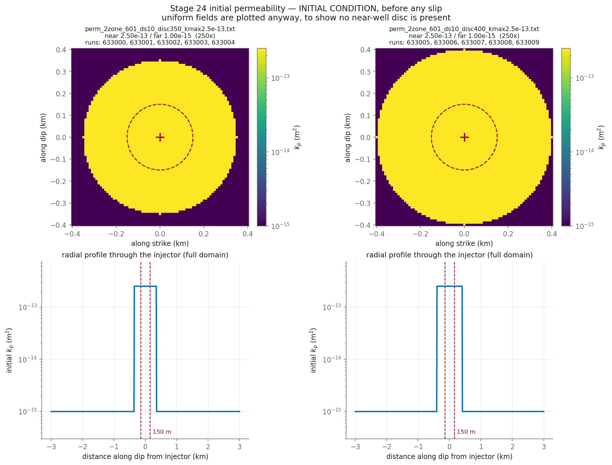

# CYCLE 2 Round 3 — fill the (tau_0 x disc radius) GRID at arm 2, disc capped at 400 m. What existed was a CROSS: tau_0 swept at disc 300 only, disc swept at tau_0 10.36 only. tau_0 raises lambda and lowers dp; the disc lowers BOTH, so a combination can reach lambda 1.0x at dp 0 where neither lever alone can. disc 350/400 m x five tau_0 (10 runs)

**Nothing here has been submitted.** This is the pre-submittal check.

## Decks

| run | parent | **permev** | **sigmabar_0** | eta Pa·s | beta 1/Pa | phi | phi*beta | kpmax | kp=kpmin | perm field | injection | muinit | tau0 MPa | dp_crit MPa | tmax d |
|---|---|---|---|---|---|---|---|---|---|---|---|---|---|---|---|
| [633000](params_633000.txt) | 632960 | **T** | **27.99** | 1.27e-4 | 2.25e-8 | 0.01 | 2.250e-10 | 2.5e-13 | 1e-15 | perm_2zone_601_ds10_disc350_kmax2.5e-13.txt (250x) | `june_clean_from_d4300.txt` | 0.3700 | 10.36 | 10.73 | 13.10 |
| [633001](params_633001.txt) | 632960 | **T** | **27.99** | 1.27e-4 | 2.25e-8 | 0.01 | 2.250e-10 | 2.5e-13 | 1e-15 | perm_2zone_601_ds10_disc350_kmax2.5e-13.txt (250x) | `june_clean_from_d4300.txt` | 0.4120 | 11.53 | 8.77 | 13.10 |
| [633002](params_633002.txt) | 632960 | **T** | **27.99** | 1.27e-4 | 2.25e-8 | 0.01 | 2.250e-10 | 2.5e-13 | 1e-15 | perm_2zone_601_ds10_disc350_kmax2.5e-13.txt (250x) | `june_clean_from_d4300.txt` | 0.4540 | 12.71 | 6.81 | 13.10 |
| [633003](params_633003.txt) | 632960 | **T** | **27.99** | 1.27e-4 | 2.25e-8 | 0.01 | 2.250e-10 | 2.5e-13 | 1e-15 | perm_2zone_601_ds10_disc350_kmax2.5e-13.txt (250x) | `june_clean_from_d4300.txt` | 0.4950 | 13.86 | 4.90 | 13.10 |
| [633004](params_633004.txt) | 632960 | **T** | **27.99** | 1.27e-4 | 2.25e-8 | 0.01 | 2.250e-10 | 2.5e-13 | 1e-15 | perm_2zone_601_ds10_disc350_kmax2.5e-13.txt (250x) | `june_clean_from_d4300.txt` | 0.5360 | 15.00 | 2.99 | 13.10 |
| [633005](params_633005.txt) | 632960 | **T** | **27.99** | 1.27e-4 | 2.25e-8 | 0.01 | 2.250e-10 | 2.5e-13 | 1e-15 | perm_2zone_601_ds10_disc400_kmax2.5e-13.txt (250x) | `june_clean_from_d4300.txt` | 0.3700 | 10.36 | 10.73 | 13.10 |
| [633006](params_633006.txt) | 632960 | **T** | **27.99** | 1.27e-4 | 2.25e-8 | 0.01 | 2.250e-10 | 2.5e-13 | 1e-15 | perm_2zone_601_ds10_disc400_kmax2.5e-13.txt (250x) | `june_clean_from_d4300.txt` | 0.4120 | 11.53 | 8.77 | 13.10 |
| [633007](params_633007.txt) | 632960 | **T** | **27.99** | 1.27e-4 | 2.25e-8 | 0.01 | 2.250e-10 | 2.5e-13 | 1e-15 | perm_2zone_601_ds10_disc400_kmax2.5e-13.txt (250x) | `june_clean_from_d4300.txt` | 0.4540 | 12.71 | 6.81 | 13.10 |
| [633008](params_633008.txt) | 632960 | **T** | **27.99** | 1.27e-4 | 2.25e-8 | 0.01 | 2.250e-10 | 2.5e-13 | 1e-15 | perm_2zone_601_ds10_disc400_kmax2.5e-13.txt (250x) | `june_clean_from_d4300.txt` | 0.4950 | 13.86 | 4.90 | 13.10 |
| [633009](params_633009.txt) | 632960 | **T** | **27.99** | 1.27e-4 | 2.25e-8 | 0.01 | 2.250e-10 | 2.5e-13 | 1e-15 | perm_2zone_601_ds10_disc400_kmax2.5e-13.txt (250x) | `june_clean_from_d4300.txt` | 0.5360 | 15.00 | 2.99 | 13.10 |

## Derived hydraulics

| run | D near m²/s | D far m²/s | str=beta*phi | T at kpmin | T at kpmax | gamma(h=60s, kpmin) | gamma(h=60s, kpmax) |
|---|---|---|---|---|---|---|---|
| 633000 | 8.7489e+00 | 3.4996e-02 | 2.250e-10 | 1.590e-11 | 3.974e-09 | 0.8858 | 0.0301 |
| 633001 | 8.7489e+00 | 3.4996e-02 | 2.250e-10 | 1.590e-11 | 3.974e-09 | 0.8858 | 0.0301 |
| 633002 | 8.7489e+00 | 3.4996e-02 | 2.250e-10 | 1.590e-11 | 3.974e-09 | 0.8858 | 0.0301 |
| 633003 | 8.7489e+00 | 3.4996e-02 | 2.250e-10 | 1.590e-11 | 3.974e-09 | 0.8858 | 0.0301 |
| 633004 | 8.7489e+00 | 3.4996e-02 | 2.250e-10 | 1.590e-11 | 3.974e-09 | 0.8858 | 0.0301 |
| 633005 | 8.7489e+00 | 3.4996e-02 | 2.250e-10 | 1.590e-11 | 3.974e-09 | 0.8858 | 0.0301 |
| 633006 | 8.7489e+00 | 3.4996e-02 | 2.250e-10 | 1.590e-11 | 3.974e-09 | 0.8858 | 0.0301 |
| 633007 | 8.7489e+00 | 3.4996e-02 | 2.250e-10 | 1.590e-11 | 3.974e-09 | 0.8858 | 0.0301 |
| 633008 | 8.7489e+00 | 3.4996e-02 | 2.250e-10 | 1.590e-11 | 3.974e-09 | 0.8858 | 0.0301 |
| 633009 | 8.7489e+00 | 3.4996e-02 | 2.250e-10 | 1.590e-11 | 3.974e-09 | 0.8858 | 0.0301 |

`str`, `T` and `gamma` are the quantities `m_diffusion.f90` actually assembles (lines 444, 669, 671). `gamma` is the one a viscosity/compressibility trade does **not** hold fixed.

## Failure feasibility — can the fault slip at the OBSERVED pressure?

Peak **measured** downhole overpressure over these 13.10 d is **11.84 MPa** (p_wh + rho·g·H − P0, with rho·g·H = 40.0 and P0 = 73.8 MPa). Slip requires Δp > Δp_crit = σ̄₀(1 − μ₀/f₀). If Δp_crit exceeds 11.84 MPa the fault can only slip by **over-pressurising past the measurement**.

| run | μ₀ | Δp_crit MPa | vs measured | verdict |
|---|---|---|---|---|
| 633000 | 0.3700 | 10.73 | -1.11 | can fail |
| 633001 | 0.4120 | 8.77 | -3.07 | can fail |
| 633002 | 0.4540 | 6.81 | -5.03 | can fail |
| 633003 | 0.4950 | 4.90 | -6.94 | can fail |
| 633004 | 0.5360 | 2.99 | -8.85 | can fail |
| 633005 | 0.3700 | 10.73 | -1.11 | can fail |
| 633006 | 0.4120 | 8.77 | -3.07 | can fail |
| 633007 | 0.4540 | 6.81 | -5.03 | can fail |
| 633008 | 0.4950 | 4.90 | -6.94 | can fail |
| 633009 | 0.5360 | 2.99 | -8.85 | can fail |

**How understressed can the fault be and still fail at the observed pressure?** μ₀ ≥ f₀(1 − Δp_obs/σ̄₀):

| σ̄₀ MPa | minimum μ₀ | minimum τ₀ MPa | source of σ̄₀ |
|---|---|---|---|
| 27.99 | **0.3462** | **9.69** | derived from σ_v 100, σ_Hmax 160, dip 10°, p_pore 73.82 |

This stage runs μ₀ = 0.3700, 0.4120, 0.4540, 0.4950, 0.5360, comfortably above the floor above, so the fault can reach failure at the measured pressure without over-pressurising. Whether it then accumulates enough slip to build a front is a separate question that the friction law, not this inequality, decides — HBI's regularised rate-and-state law has no failure threshold, so Δp_crit is an orientation number here and not a prediction.

## Initial condition



## Deck diffs against parents

- [`res633000.in` vs `res632960.in`](diff_633000.txt)
- [`res633001.in` vs `res632960.in`](diff_633001.txt)
- [`res633002.in` vs `res632960.in`](diff_633002.txt)
- [`res633003.in` vs `res632960.in`](diff_633003.txt)
- [`res633004.in` vs `res632960.in`](diff_633004.txt)
- [`res633005.in` vs `res632960.in`](diff_633005.txt)
- [`res633006.in` vs `res632960.in`](diff_633006.txt)
- [`res633007.in` vs `res632960.in`](diff_633007.txt)
- [`res633008.in` vs `res632960.in`](diff_633008.txt)
- [`res633009.in` vs `res632960.in`](diff_633009.txt)

## Launch commands, once approved

```bash
cd /home/groups/edunham/nberrios/3dhbi/examples/grid_search_inputs
sbatch march26_submit_hbi_git_scratch.sh -i res633000.in -w june_clean.txt -p perm_2zone_601_ds10_disc350_kmax2.5e-13.txt
sbatch march26_submit_hbi_git_scratch.sh -i res633001.in -w june_clean.txt -p perm_2zone_601_ds10_disc350_kmax2.5e-13.txt
sbatch march26_submit_hbi_git_scratch.sh -i res633002.in -w june_clean.txt -p perm_2zone_601_ds10_disc350_kmax2.5e-13.txt
sbatch march26_submit_hbi_git_scratch.sh -i res633003.in -w june_clean.txt -p perm_2zone_601_ds10_disc350_kmax2.5e-13.txt
sbatch march26_submit_hbi_git_scratch.sh -i res633004.in -w june_clean.txt -p perm_2zone_601_ds10_disc350_kmax2.5e-13.txt
sbatch march26_submit_hbi_git_scratch.sh -i res633005.in -w june_clean.txt -p perm_2zone_601_ds10_disc400_kmax2.5e-13.txt
sbatch march26_submit_hbi_git_scratch.sh -i res633006.in -w june_clean.txt -p perm_2zone_601_ds10_disc400_kmax2.5e-13.txt
sbatch march26_submit_hbi_git_scratch.sh -i res633007.in -w june_clean.txt -p perm_2zone_601_ds10_disc400_kmax2.5e-13.txt
sbatch march26_submit_hbi_git_scratch.sh -i res633008.in -w june_clean.txt -p perm_2zone_601_ds10_disc400_kmax2.5e-13.txt
sbatch march26_submit_hbi_git_scratch.sh -i res633009.in -w june_clean.txt -p perm_2zone_601_ds10_disc400_kmax2.5e-13.txt
```
