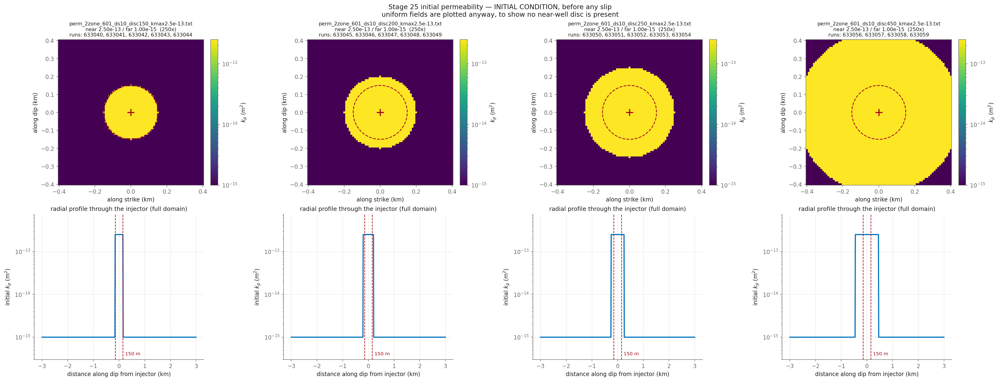

# CYCLE 2 Round 3b — the rest of the (tau_0 x disc) GRID at arm 2: disc 150, 200, 250 and 450 m x five tau_0, completing 150-450 m together with the 300 m column (632960-4) and the 350/400 m columns (633000-9). 633055 is absent because disc 450 x tau_0 10.36 already exists as 632993 (19 runs)

**Nothing here has been submitted.** This is the pre-submittal check.

## Decks

| run | parent | **permev** | **sigmabar_0** | eta Pa·s | beta 1/Pa | phi | phi*beta | kpmax | kp=kpmin | perm field | injection | muinit | tau0 MPa | dp_crit MPa | tmax d |
|---|---|---|---|---|---|---|---|---|---|---|---|---|---|---|---|
| [633040](params_633040.txt) | 632960 | **T** | **27.99** | 1.27e-4 | 2.25e-8 | 0.01 | 2.250e-10 | 2.5e-13 | 1e-15 | perm_2zone_601_ds10_disc150_kmax2.5e-13.txt (250x) | `june_clean_from_d4300.txt` | 0.3700 | 10.36 | 10.73 | 13.10 |
| [633041](params_633041.txt) | 632960 | **T** | **27.99** | 1.27e-4 | 2.25e-8 | 0.01 | 2.250e-10 | 2.5e-13 | 1e-15 | perm_2zone_601_ds10_disc150_kmax2.5e-13.txt (250x) | `june_clean_from_d4300.txt` | 0.4120 | 11.53 | 8.77 | 13.10 |
| [633042](params_633042.txt) | 632960 | **T** | **27.99** | 1.27e-4 | 2.25e-8 | 0.01 | 2.250e-10 | 2.5e-13 | 1e-15 | perm_2zone_601_ds10_disc150_kmax2.5e-13.txt (250x) | `june_clean_from_d4300.txt` | 0.4540 | 12.71 | 6.81 | 13.10 |
| [633043](params_633043.txt) | 632960 | **T** | **27.99** | 1.27e-4 | 2.25e-8 | 0.01 | 2.250e-10 | 2.5e-13 | 1e-15 | perm_2zone_601_ds10_disc150_kmax2.5e-13.txt (250x) | `june_clean_from_d4300.txt` | 0.4950 | 13.86 | 4.90 | 13.10 |
| [633044](params_633044.txt) | 632960 | **T** | **27.99** | 1.27e-4 | 2.25e-8 | 0.01 | 2.250e-10 | 2.5e-13 | 1e-15 | perm_2zone_601_ds10_disc150_kmax2.5e-13.txt (250x) | `june_clean_from_d4300.txt` | 0.5360 | 15.00 | 2.99 | 13.10 |
| [633045](params_633045.txt) | 632960 | **T** | **27.99** | 1.27e-4 | 2.25e-8 | 0.01 | 2.250e-10 | 2.5e-13 | 1e-15 | perm_2zone_601_ds10_disc200_kmax2.5e-13.txt (250x) | `june_clean_from_d4300.txt` | 0.3700 | 10.36 | 10.73 | 13.10 |
| [633046](params_633046.txt) | 632960 | **T** | **27.99** | 1.27e-4 | 2.25e-8 | 0.01 | 2.250e-10 | 2.5e-13 | 1e-15 | perm_2zone_601_ds10_disc200_kmax2.5e-13.txt (250x) | `june_clean_from_d4300.txt` | 0.4120 | 11.53 | 8.77 | 13.10 |
| [633047](params_633047.txt) | 632960 | **T** | **27.99** | 1.27e-4 | 2.25e-8 | 0.01 | 2.250e-10 | 2.5e-13 | 1e-15 | perm_2zone_601_ds10_disc200_kmax2.5e-13.txt (250x) | `june_clean_from_d4300.txt` | 0.4540 | 12.71 | 6.81 | 13.10 |
| [633048](params_633048.txt) | 632960 | **T** | **27.99** | 1.27e-4 | 2.25e-8 | 0.01 | 2.250e-10 | 2.5e-13 | 1e-15 | perm_2zone_601_ds10_disc200_kmax2.5e-13.txt (250x) | `june_clean_from_d4300.txt` | 0.4950 | 13.86 | 4.90 | 13.10 |
| [633049](params_633049.txt) | 632960 | **T** | **27.99** | 1.27e-4 | 2.25e-8 | 0.01 | 2.250e-10 | 2.5e-13 | 1e-15 | perm_2zone_601_ds10_disc200_kmax2.5e-13.txt (250x) | `june_clean_from_d4300.txt` | 0.5360 | 15.00 | 2.99 | 13.10 |
| [633050](params_633050.txt) | 632960 | **T** | **27.99** | 1.27e-4 | 2.25e-8 | 0.01 | 2.250e-10 | 2.5e-13 | 1e-15 | perm_2zone_601_ds10_disc250_kmax2.5e-13.txt (250x) | `june_clean_from_d4300.txt` | 0.3700 | 10.36 | 10.73 | 13.10 |
| [633051](params_633051.txt) | 632960 | **T** | **27.99** | 1.27e-4 | 2.25e-8 | 0.01 | 2.250e-10 | 2.5e-13 | 1e-15 | perm_2zone_601_ds10_disc250_kmax2.5e-13.txt (250x) | `june_clean_from_d4300.txt` | 0.4120 | 11.53 | 8.77 | 13.10 |
| [633052](params_633052.txt) | 632960 | **T** | **27.99** | 1.27e-4 | 2.25e-8 | 0.01 | 2.250e-10 | 2.5e-13 | 1e-15 | perm_2zone_601_ds10_disc250_kmax2.5e-13.txt (250x) | `june_clean_from_d4300.txt` | 0.4540 | 12.71 | 6.81 | 13.10 |
| [633053](params_633053.txt) | 632960 | **T** | **27.99** | 1.27e-4 | 2.25e-8 | 0.01 | 2.250e-10 | 2.5e-13 | 1e-15 | perm_2zone_601_ds10_disc250_kmax2.5e-13.txt (250x) | `june_clean_from_d4300.txt` | 0.4950 | 13.86 | 4.90 | 13.10 |
| [633054](params_633054.txt) | 632960 | **T** | **27.99** | 1.27e-4 | 2.25e-8 | 0.01 | 2.250e-10 | 2.5e-13 | 1e-15 | perm_2zone_601_ds10_disc250_kmax2.5e-13.txt (250x) | `june_clean_from_d4300.txt` | 0.5360 | 15.00 | 2.99 | 13.10 |
| [633056](params_633056.txt) | 632960 | **T** | **27.99** | 1.27e-4 | 2.25e-8 | 0.01 | 2.250e-10 | 2.5e-13 | 1e-15 | perm_2zone_601_ds10_disc450_kmax2.5e-13.txt (250x) | `june_clean_from_d4300.txt` | 0.4120 | 11.53 | 8.77 | 13.10 |
| [633057](params_633057.txt) | 632960 | **T** | **27.99** | 1.27e-4 | 2.25e-8 | 0.01 | 2.250e-10 | 2.5e-13 | 1e-15 | perm_2zone_601_ds10_disc450_kmax2.5e-13.txt (250x) | `june_clean_from_d4300.txt` | 0.4540 | 12.71 | 6.81 | 13.10 |
| [633058](params_633058.txt) | 632960 | **T** | **27.99** | 1.27e-4 | 2.25e-8 | 0.01 | 2.250e-10 | 2.5e-13 | 1e-15 | perm_2zone_601_ds10_disc450_kmax2.5e-13.txt (250x) | `june_clean_from_d4300.txt` | 0.4950 | 13.86 | 4.90 | 13.10 |
| [633059](params_633059.txt) | 632960 | **T** | **27.99** | 1.27e-4 | 2.25e-8 | 0.01 | 2.250e-10 | 2.5e-13 | 1e-15 | perm_2zone_601_ds10_disc450_kmax2.5e-13.txt (250x) | `june_clean_from_d4300.txt` | 0.5360 | 15.00 | 2.99 | 13.10 |

## Derived hydraulics

| run | D near m²/s | D far m²/s | str=beta*phi | T at kpmin | T at kpmax | gamma(h=60s, kpmin) | gamma(h=60s, kpmax) |
|---|---|---|---|---|---|---|---|
| 633040 | 8.7489e+00 | 3.4996e-02 | 2.250e-10 | 1.590e-11 | 3.974e-09 | 0.8858 | 0.0301 |
| 633041 | 8.7489e+00 | 3.4996e-02 | 2.250e-10 | 1.590e-11 | 3.974e-09 | 0.8858 | 0.0301 |
| 633042 | 8.7489e+00 | 3.4996e-02 | 2.250e-10 | 1.590e-11 | 3.974e-09 | 0.8858 | 0.0301 |
| 633043 | 8.7489e+00 | 3.4996e-02 | 2.250e-10 | 1.590e-11 | 3.974e-09 | 0.8858 | 0.0301 |
| 633044 | 8.7489e+00 | 3.4996e-02 | 2.250e-10 | 1.590e-11 | 3.974e-09 | 0.8858 | 0.0301 |
| 633045 | 8.7489e+00 | 3.4996e-02 | 2.250e-10 | 1.590e-11 | 3.974e-09 | 0.8858 | 0.0301 |
| 633046 | 8.7489e+00 | 3.4996e-02 | 2.250e-10 | 1.590e-11 | 3.974e-09 | 0.8858 | 0.0301 |
| 633047 | 8.7489e+00 | 3.4996e-02 | 2.250e-10 | 1.590e-11 | 3.974e-09 | 0.8858 | 0.0301 |
| 633048 | 8.7489e+00 | 3.4996e-02 | 2.250e-10 | 1.590e-11 | 3.974e-09 | 0.8858 | 0.0301 |
| 633049 | 8.7489e+00 | 3.4996e-02 | 2.250e-10 | 1.590e-11 | 3.974e-09 | 0.8858 | 0.0301 |
| 633050 | 8.7489e+00 | 3.4996e-02 | 2.250e-10 | 1.590e-11 | 3.974e-09 | 0.8858 | 0.0301 |
| 633051 | 8.7489e+00 | 3.4996e-02 | 2.250e-10 | 1.590e-11 | 3.974e-09 | 0.8858 | 0.0301 |
| 633052 | 8.7489e+00 | 3.4996e-02 | 2.250e-10 | 1.590e-11 | 3.974e-09 | 0.8858 | 0.0301 |
| 633053 | 8.7489e+00 | 3.4996e-02 | 2.250e-10 | 1.590e-11 | 3.974e-09 | 0.8858 | 0.0301 |
| 633054 | 8.7489e+00 | 3.4996e-02 | 2.250e-10 | 1.590e-11 | 3.974e-09 | 0.8858 | 0.0301 |
| 633056 | 8.7489e+00 | 3.4996e-02 | 2.250e-10 | 1.590e-11 | 3.974e-09 | 0.8858 | 0.0301 |
| 633057 | 8.7489e+00 | 3.4996e-02 | 2.250e-10 | 1.590e-11 | 3.974e-09 | 0.8858 | 0.0301 |
| 633058 | 8.7489e+00 | 3.4996e-02 | 2.250e-10 | 1.590e-11 | 3.974e-09 | 0.8858 | 0.0301 |
| 633059 | 8.7489e+00 | 3.4996e-02 | 2.250e-10 | 1.590e-11 | 3.974e-09 | 0.8858 | 0.0301 |

`str`, `T` and `gamma` are the quantities `m_diffusion.f90` actually assembles (lines 444, 669, 671). `gamma` is the one a viscosity/compressibility trade does **not** hold fixed.

## Failure feasibility — can the fault slip at the OBSERVED pressure?

Peak **measured** downhole overpressure over these 13.10 d is **11.84 MPa** (p_wh + rho·g·H − P0, with rho·g·H = 40.0 and P0 = 73.8 MPa). Slip requires Δp > Δp_crit = σ̄₀(1 − μ₀/f₀). If Δp_crit exceeds 11.84 MPa the fault can only slip by **over-pressurising past the measurement**.

| run | μ₀ | Δp_crit MPa | vs measured | verdict |
|---|---|---|---|---|
| 633040 | 0.3700 | 10.73 | -1.11 | can fail |
| 633041 | 0.4120 | 8.77 | -3.07 | can fail |
| 633042 | 0.4540 | 6.81 | -5.03 | can fail |
| 633043 | 0.4950 | 4.90 | -6.94 | can fail |
| 633044 | 0.5360 | 2.99 | -8.85 | can fail |
| 633045 | 0.3700 | 10.73 | -1.11 | can fail |
| 633046 | 0.4120 | 8.77 | -3.07 | can fail |
| 633047 | 0.4540 | 6.81 | -5.03 | can fail |
| 633048 | 0.4950 | 4.90 | -6.94 | can fail |
| 633049 | 0.5360 | 2.99 | -8.85 | can fail |
| 633050 | 0.3700 | 10.73 | -1.11 | can fail |
| 633051 | 0.4120 | 8.77 | -3.07 | can fail |
| 633052 | 0.4540 | 6.81 | -5.03 | can fail |
| 633053 | 0.4950 | 4.90 | -6.94 | can fail |
| 633054 | 0.5360 | 2.99 | -8.85 | can fail |
| 633056 | 0.4120 | 8.77 | -3.07 | can fail |
| 633057 | 0.4540 | 6.81 | -5.03 | can fail |
| 633058 | 0.4950 | 4.90 | -6.94 | can fail |
| 633059 | 0.5360 | 2.99 | -8.85 | can fail |

**How understressed can the fault be and still fail at the observed pressure?** μ₀ ≥ f₀(1 − Δp_obs/σ̄₀):

| σ̄₀ MPa | minimum μ₀ | minimum τ₀ MPa | source of σ̄₀ |
|---|---|---|---|
| 27.99 | **0.3462** | **9.69** | derived from σ_v 100, σ_Hmax 160, dip 10°, p_pore 73.82 |

This stage runs μ₀ = 0.3700, 0.4120, 0.4540, 0.4950, 0.5360, comfortably above the floor above, so the fault can reach failure at the measured pressure without over-pressurising. Whether it then accumulates enough slip to build a front is a separate question that the friction law, not this inequality, decides — HBI's regularised rate-and-state law has no failure threshold, so Δp_crit is an orientation number here and not a prediction.

## Initial condition



## Deck diffs against parents

- [`res633040.in` vs `res632960.in`](diff_633040.txt)
- [`res633041.in` vs `res632960.in`](diff_633041.txt)
- [`res633042.in` vs `res632960.in`](diff_633042.txt)
- [`res633043.in` vs `res632960.in`](diff_633043.txt)
- [`res633044.in` vs `res632960.in`](diff_633044.txt)
- [`res633045.in` vs `res632960.in`](diff_633045.txt)
- [`res633046.in` vs `res632960.in`](diff_633046.txt)
- [`res633047.in` vs `res632960.in`](diff_633047.txt)
- [`res633048.in` vs `res632960.in`](diff_633048.txt)
- [`res633049.in` vs `res632960.in`](diff_633049.txt)
- [`res633050.in` vs `res632960.in`](diff_633050.txt)
- [`res633051.in` vs `res632960.in`](diff_633051.txt)
- [`res633052.in` vs `res632960.in`](diff_633052.txt)
- [`res633053.in` vs `res632960.in`](diff_633053.txt)
- [`res633054.in` vs `res632960.in`](diff_633054.txt)
- [`res633056.in` vs `res632960.in`](diff_633056.txt)
- [`res633057.in` vs `res632960.in`](diff_633057.txt)
- [`res633058.in` vs `res632960.in`](diff_633058.txt)
- [`res633059.in` vs `res632960.in`](diff_633059.txt)

## Launch commands, once approved

```bash
cd /home/groups/edunham/nberrios/3dhbi/examples/grid_search_inputs
sbatch march26_submit_hbi_git_scratch.sh -i res633040.in -w june_clean.txt -p perm_2zone_601_ds10_disc150_kmax2.5e-13.txt
sbatch march26_submit_hbi_git_scratch.sh -i res633041.in -w june_clean.txt -p perm_2zone_601_ds10_disc150_kmax2.5e-13.txt
sbatch march26_submit_hbi_git_scratch.sh -i res633042.in -w june_clean.txt -p perm_2zone_601_ds10_disc150_kmax2.5e-13.txt
sbatch march26_submit_hbi_git_scratch.sh -i res633043.in -w june_clean.txt -p perm_2zone_601_ds10_disc150_kmax2.5e-13.txt
sbatch march26_submit_hbi_git_scratch.sh -i res633044.in -w june_clean.txt -p perm_2zone_601_ds10_disc150_kmax2.5e-13.txt
sbatch march26_submit_hbi_git_scratch.sh -i res633045.in -w june_clean.txt -p perm_2zone_601_ds10_disc200_kmax2.5e-13.txt
sbatch march26_submit_hbi_git_scratch.sh -i res633046.in -w june_clean.txt -p perm_2zone_601_ds10_disc200_kmax2.5e-13.txt
sbatch march26_submit_hbi_git_scratch.sh -i res633047.in -w june_clean.txt -p perm_2zone_601_ds10_disc200_kmax2.5e-13.txt
sbatch march26_submit_hbi_git_scratch.sh -i res633048.in -w june_clean.txt -p perm_2zone_601_ds10_disc200_kmax2.5e-13.txt
sbatch march26_submit_hbi_git_scratch.sh -i res633049.in -w june_clean.txt -p perm_2zone_601_ds10_disc200_kmax2.5e-13.txt
sbatch march26_submit_hbi_git_scratch.sh -i res633050.in -w june_clean.txt -p perm_2zone_601_ds10_disc250_kmax2.5e-13.txt
sbatch march26_submit_hbi_git_scratch.sh -i res633051.in -w june_clean.txt -p perm_2zone_601_ds10_disc250_kmax2.5e-13.txt
sbatch march26_submit_hbi_git_scratch.sh -i res633052.in -w june_clean.txt -p perm_2zone_601_ds10_disc250_kmax2.5e-13.txt
sbatch march26_submit_hbi_git_scratch.sh -i res633053.in -w june_clean.txt -p perm_2zone_601_ds10_disc250_kmax2.5e-13.txt
sbatch march26_submit_hbi_git_scratch.sh -i res633054.in -w june_clean.txt -p perm_2zone_601_ds10_disc250_kmax2.5e-13.txt
sbatch march26_submit_hbi_git_scratch.sh -i res633056.in -w june_clean.txt -p perm_2zone_601_ds10_disc450_kmax2.5e-13.txt
sbatch march26_submit_hbi_git_scratch.sh -i res633057.in -w june_clean.txt -p perm_2zone_601_ds10_disc450_kmax2.5e-13.txt
sbatch march26_submit_hbi_git_scratch.sh -i res633058.in -w june_clean.txt -p perm_2zone_601_ds10_disc450_kmax2.5e-13.txt
sbatch march26_submit_hbi_git_scratch.sh -i res633059.in -w june_clean.txt -p perm_2zone_601_ds10_disc450_kmax2.5e-13.txt
```
