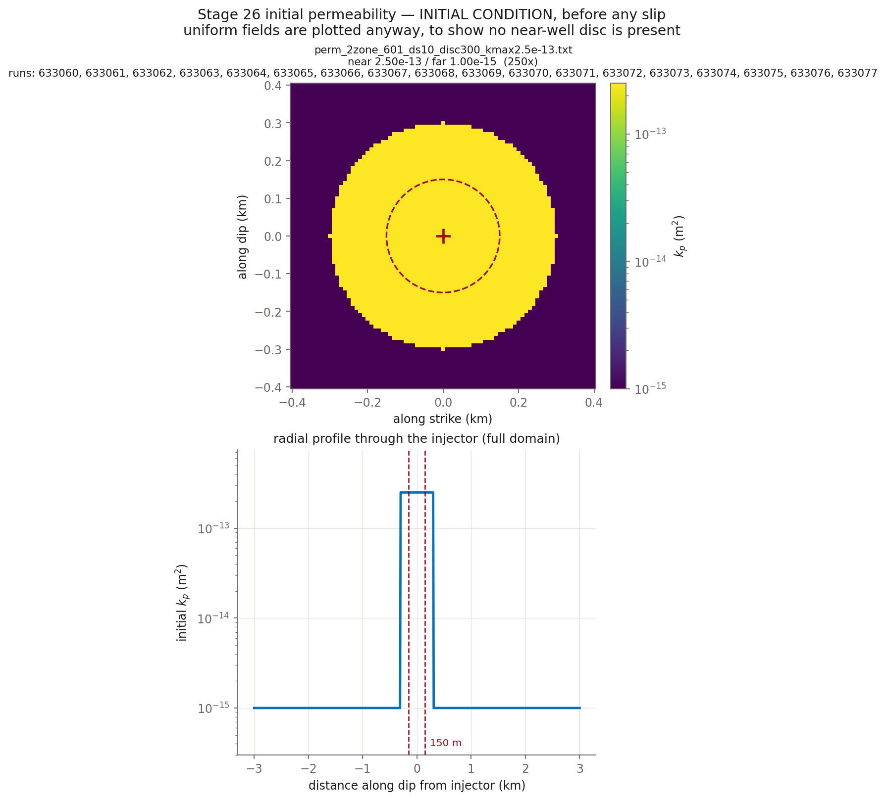

# CYCLE 2 Round 4 — the STORAGE sweep. The model pressurises too fast in the first two days (9.4x too high at 6 h, 2.5x at 1 d, but only 1.25x by the 4-8 d plateau), so the error is a TRANSIENT and not an injectivity error. Two one-key sweeps at each of tau_0 10.36/11.53/12.71: phi x2/x5/x10 (formation storage, must also slow the front) and Sw_fwid x10/x100/x1000 (wellbore storage, CANNOT touch the front). Distinguishable for exactly that reason (18 runs)

**Nothing here has been submitted.** This is the pre-submittal check.

## Decks

| run | parent | **permev** | **sigmabar_0** | eta Pa·s | beta 1/Pa | phi | phi*beta | kpmax | kp=kpmin | perm field | injection | muinit | tau0 MPa | dp_crit MPa | tmax d |
|---|---|---|---|---|---|---|---|---|---|---|---|---|---|---|---|
| [633060](params_633060.txt) | 632960 | **T** | **27.99** | 1.27e-4 | 2.25e-8 | 0.02 | 4.500e-10 | 2.5e-13 | 1e-15 | perm_2zone_601_ds10_disc300_kmax2.5e-13.txt (250x) | `june_clean_from_d4300.txt` | 0.3700 | 10.36 | 10.73 | 13.10 |
| [633061](params_633061.txt) | 632960 | **T** | **27.99** | 1.27e-4 | 2.25e-8 | 0.05 | 1.125e-09 | 2.5e-13 | 1e-15 | perm_2zone_601_ds10_disc300_kmax2.5e-13.txt (250x) | `june_clean_from_d4300.txt` | 0.3700 | 10.36 | 10.73 | 13.10 |
| [633062](params_633062.txt) | 632960 | **T** | **27.99** | 1.27e-4 | 2.25e-8 | 0.1 | 2.250e-09 | 2.5e-13 | 1e-15 | perm_2zone_601_ds10_disc300_kmax2.5e-13.txt (250x) | `june_clean_from_d4300.txt` | 0.3700 | 10.36 | 10.73 | 13.10 |
| [633063](params_633063.txt) | 632960 | **T** | **27.99** | 1.27e-4 | 2.25e-8 | 0.01 | 2.250e-10 | 2.5e-13 | 1e-15 | perm_2zone_601_ds10_disc300_kmax2.5e-13.txt (250x) | `june_clean_from_d4300.txt` | 0.3700 | 10.36 | 10.73 | 13.10 |
| [633064](params_633064.txt) | 632960 | **T** | **27.99** | 1.27e-4 | 2.25e-8 | 0.01 | 2.250e-10 | 2.5e-13 | 1e-15 | perm_2zone_601_ds10_disc300_kmax2.5e-13.txt (250x) | `june_clean_from_d4300.txt` | 0.3700 | 10.36 | 10.73 | 13.10 |
| [633065](params_633065.txt) | 632960 | **T** | **27.99** | 1.27e-4 | 2.25e-8 | 0.01 | 2.250e-10 | 2.5e-13 | 1e-15 | perm_2zone_601_ds10_disc300_kmax2.5e-13.txt (250x) | `june_clean_from_d4300.txt` | 0.3700 | 10.36 | 10.73 | 13.10 |
| [633066](params_633066.txt) | 632961 | **T** | **27.99** | 1.27e-4 | 2.25e-8 | 0.02 | 4.500e-10 | 2.5e-13 | 1e-15 | perm_2zone_601_ds10_disc300_kmax2.5e-13.txt (250x) | `june_clean_from_d4300.txt` | 0.4120 | 11.53 | 8.77 | 13.10 |
| [633067](params_633067.txt) | 632961 | **T** | **27.99** | 1.27e-4 | 2.25e-8 | 0.05 | 1.125e-09 | 2.5e-13 | 1e-15 | perm_2zone_601_ds10_disc300_kmax2.5e-13.txt (250x) | `june_clean_from_d4300.txt` | 0.4120 | 11.53 | 8.77 | 13.10 |
| [633068](params_633068.txt) | 632961 | **T** | **27.99** | 1.27e-4 | 2.25e-8 | 0.1 | 2.250e-09 | 2.5e-13 | 1e-15 | perm_2zone_601_ds10_disc300_kmax2.5e-13.txt (250x) | `june_clean_from_d4300.txt` | 0.4120 | 11.53 | 8.77 | 13.10 |
| [633069](params_633069.txt) | 632961 | **T** | **27.99** | 1.27e-4 | 2.25e-8 | 0.01 | 2.250e-10 | 2.5e-13 | 1e-15 | perm_2zone_601_ds10_disc300_kmax2.5e-13.txt (250x) | `june_clean_from_d4300.txt` | 0.4120 | 11.53 | 8.77 | 13.10 |
| [633070](params_633070.txt) | 632961 | **T** | **27.99** | 1.27e-4 | 2.25e-8 | 0.01 | 2.250e-10 | 2.5e-13 | 1e-15 | perm_2zone_601_ds10_disc300_kmax2.5e-13.txt (250x) | `june_clean_from_d4300.txt` | 0.4120 | 11.53 | 8.77 | 13.10 |
| [633071](params_633071.txt) | 632961 | **T** | **27.99** | 1.27e-4 | 2.25e-8 | 0.01 | 2.250e-10 | 2.5e-13 | 1e-15 | perm_2zone_601_ds10_disc300_kmax2.5e-13.txt (250x) | `june_clean_from_d4300.txt` | 0.4120 | 11.53 | 8.77 | 13.10 |
| [633072](params_633072.txt) | 632962 | **T** | **27.99** | 1.27e-4 | 2.25e-8 | 0.02 | 4.500e-10 | 2.5e-13 | 1e-15 | perm_2zone_601_ds10_disc300_kmax2.5e-13.txt (250x) | `june_clean_from_d4300.txt` | 0.4540 | 12.71 | 6.81 | 13.10 |
| [633073](params_633073.txt) | 632962 | **T** | **27.99** | 1.27e-4 | 2.25e-8 | 0.05 | 1.125e-09 | 2.5e-13 | 1e-15 | perm_2zone_601_ds10_disc300_kmax2.5e-13.txt (250x) | `june_clean_from_d4300.txt` | 0.4540 | 12.71 | 6.81 | 13.10 |
| [633074](params_633074.txt) | 632962 | **T** | **27.99** | 1.27e-4 | 2.25e-8 | 0.1 | 2.250e-09 | 2.5e-13 | 1e-15 | perm_2zone_601_ds10_disc300_kmax2.5e-13.txt (250x) | `june_clean_from_d4300.txt` | 0.4540 | 12.71 | 6.81 | 13.10 |
| [633075](params_633075.txt) | 632962 | **T** | **27.99** | 1.27e-4 | 2.25e-8 | 0.01 | 2.250e-10 | 2.5e-13 | 1e-15 | perm_2zone_601_ds10_disc300_kmax2.5e-13.txt (250x) | `june_clean_from_d4300.txt` | 0.4540 | 12.71 | 6.81 | 13.10 |
| [633076](params_633076.txt) | 632962 | **T** | **27.99** | 1.27e-4 | 2.25e-8 | 0.01 | 2.250e-10 | 2.5e-13 | 1e-15 | perm_2zone_601_ds10_disc300_kmax2.5e-13.txt (250x) | `june_clean_from_d4300.txt` | 0.4540 | 12.71 | 6.81 | 13.10 |
| [633077](params_633077.txt) | 632962 | **T** | **27.99** | 1.27e-4 | 2.25e-8 | 0.01 | 2.250e-10 | 2.5e-13 | 1e-15 | perm_2zone_601_ds10_disc300_kmax2.5e-13.txt (250x) | `june_clean_from_d4300.txt` | 0.4540 | 12.71 | 6.81 | 13.10 |

## Derived hydraulics

| run | D near m²/s | D far m²/s | str=beta*phi | T at kpmin | T at kpmax | gamma(h=60s, kpmin) | gamma(h=60s, kpmax) |
|---|---|---|---|---|---|---|---|
| 633060 | 4.3745e+00 | 1.7498e-02 | 4.500e-10 | 1.590e-11 | 3.974e-09 | 0.8858 | 0.0301 |
| 633061 | 1.7498e+00 | 6.9991e-03 | 1.125e-09 | 1.590e-11 | 3.974e-09 | 0.8858 | 0.0301 |
| 633062 | 8.7489e-01 | 3.4996e-03 | 2.250e-09 | 1.590e-11 | 3.974e-09 | 0.8858 | 0.0301 |
| 633063 | 8.7489e+00 | 3.4996e-02 | 2.250e-10 | 1.590e-11 | 3.974e-09 | 0.9873 | 0.2368 |
| 633064 | 8.7489e+00 | 3.4996e-02 | 2.250e-10 | 1.590e-11 | 3.974e-09 | 0.9987 | 0.7563 |
| 633065 | 8.7489e+00 | 3.4996e-02 | 2.250e-10 | 1.590e-11 | 3.974e-09 | 0.9999 | 0.9688 |
| 633066 | 4.3745e+00 | 1.7498e-02 | 4.500e-10 | 1.590e-11 | 3.974e-09 | 0.8858 | 0.0301 |
| 633067 | 1.7498e+00 | 6.9991e-03 | 1.125e-09 | 1.590e-11 | 3.974e-09 | 0.8858 | 0.0301 |
| 633068 | 8.7489e-01 | 3.4996e-03 | 2.250e-09 | 1.590e-11 | 3.974e-09 | 0.8858 | 0.0301 |
| 633069 | 8.7489e+00 | 3.4996e-02 | 2.250e-10 | 1.590e-11 | 3.974e-09 | 0.9873 | 0.2368 |
| 633070 | 8.7489e+00 | 3.4996e-02 | 2.250e-10 | 1.590e-11 | 3.974e-09 | 0.9987 | 0.7563 |
| 633071 | 8.7489e+00 | 3.4996e-02 | 2.250e-10 | 1.590e-11 | 3.974e-09 | 0.9999 | 0.9688 |
| 633072 | 4.3745e+00 | 1.7498e-02 | 4.500e-10 | 1.590e-11 | 3.974e-09 | 0.8858 | 0.0301 |
| 633073 | 1.7498e+00 | 6.9991e-03 | 1.125e-09 | 1.590e-11 | 3.974e-09 | 0.8858 | 0.0301 |
| 633074 | 8.7489e-01 | 3.4996e-03 | 2.250e-09 | 1.590e-11 | 3.974e-09 | 0.8858 | 0.0301 |
| 633075 | 8.7489e+00 | 3.4996e-02 | 2.250e-10 | 1.590e-11 | 3.974e-09 | 0.9873 | 0.2368 |
| 633076 | 8.7489e+00 | 3.4996e-02 | 2.250e-10 | 1.590e-11 | 3.974e-09 | 0.9987 | 0.7563 |
| 633077 | 8.7489e+00 | 3.4996e-02 | 2.250e-10 | 1.590e-11 | 3.974e-09 | 0.9999 | 0.9688 |

`str`, `T` and `gamma` are the quantities `m_diffusion.f90` actually assembles (lines 444, 669, 671). `gamma` is the one a viscosity/compressibility trade does **not** hold fixed.

## Failure feasibility — can the fault slip at the OBSERVED pressure?

Peak **measured** downhole overpressure over these 13.10 d is **11.84 MPa** (p_wh + rho·g·H − P0, with rho·g·H = 40.0 and P0 = 73.8 MPa). Slip requires Δp > Δp_crit = σ̄₀(1 − μ₀/f₀). If Δp_crit exceeds 11.84 MPa the fault can only slip by **over-pressurising past the measurement**.

| run | μ₀ | Δp_crit MPa | vs measured | verdict |
|---|---|---|---|---|
| 633060 | 0.3700 | 10.73 | -1.11 | can fail |
| 633061 | 0.3700 | 10.73 | -1.11 | can fail |
| 633062 | 0.3700 | 10.73 | -1.11 | can fail |
| 633063 | 0.3700 | 10.73 | -1.11 | can fail |
| 633064 | 0.3700 | 10.73 | -1.11 | can fail |
| 633065 | 0.3700 | 10.73 | -1.11 | can fail |
| 633066 | 0.4120 | 8.77 | -3.07 | can fail |
| 633067 | 0.4120 | 8.77 | -3.07 | can fail |
| 633068 | 0.4120 | 8.77 | -3.07 | can fail |
| 633069 | 0.4120 | 8.77 | -3.07 | can fail |
| 633070 | 0.4120 | 8.77 | -3.07 | can fail |
| 633071 | 0.4120 | 8.77 | -3.07 | can fail |
| 633072 | 0.4540 | 6.81 | -5.03 | can fail |
| 633073 | 0.4540 | 6.81 | -5.03 | can fail |
| 633074 | 0.4540 | 6.81 | -5.03 | can fail |
| 633075 | 0.4540 | 6.81 | -5.03 | can fail |
| 633076 | 0.4540 | 6.81 | -5.03 | can fail |
| 633077 | 0.4540 | 6.81 | -5.03 | can fail |

**How understressed can the fault be and still fail at the observed pressure?** μ₀ ≥ f₀(1 − Δp_obs/σ̄₀):

| σ̄₀ MPa | minimum μ₀ | minimum τ₀ MPa | source of σ̄₀ |
|---|---|---|---|
| 27.99 | **0.3462** | **9.69** | derived from σ_v 100, σ_Hmax 160, dip 10°, p_pore 73.82 |

This stage runs μ₀ = 0.3700, 0.4120, 0.4540, comfortably above the floor above, so the fault can reach failure at the measured pressure without over-pressurising. Whether it then accumulates enough slip to build a front is a separate question that the friction law, not this inequality, decides — HBI's regularised rate-and-state law has no failure threshold, so Δp_crit is an orientation number here and not a prediction.

## Initial condition



## Deck diffs against parents

- [`res633060.in` vs `res632960.in`](diff_633060.txt)
- [`res633061.in` vs `res632960.in`](diff_633061.txt)
- [`res633062.in` vs `res632960.in`](diff_633062.txt)
- [`res633063.in` vs `res632960.in`](diff_633063.txt)
- [`res633064.in` vs `res632960.in`](diff_633064.txt)
- [`res633065.in` vs `res632960.in`](diff_633065.txt)
- [`res633066.in` vs `res632961.in`](diff_633066.txt)
- [`res633067.in` vs `res632961.in`](diff_633067.txt)
- [`res633068.in` vs `res632961.in`](diff_633068.txt)
- [`res633069.in` vs `res632961.in`](diff_633069.txt)
- [`res633070.in` vs `res632961.in`](diff_633070.txt)
- [`res633071.in` vs `res632961.in`](diff_633071.txt)
- [`res633072.in` vs `res632962.in`](diff_633072.txt)
- [`res633073.in` vs `res632962.in`](diff_633073.txt)
- [`res633074.in` vs `res632962.in`](diff_633074.txt)
- [`res633075.in` vs `res632962.in`](diff_633075.txt)
- [`res633076.in` vs `res632962.in`](diff_633076.txt)
- [`res633077.in` vs `res632962.in`](diff_633077.txt)

## Launch commands, once approved

```bash
cd /home/groups/edunham/nberrios/3dhbi/examples/grid_search_inputs
sbatch march26_submit_hbi_git_scratch.sh -i res633060.in -w june_clean.txt -p perm_2zone_601_ds10_disc300_kmax2.5e-13.txt
sbatch march26_submit_hbi_git_scratch.sh -i res633061.in -w june_clean.txt -p perm_2zone_601_ds10_disc300_kmax2.5e-13.txt
sbatch march26_submit_hbi_git_scratch.sh -i res633062.in -w june_clean.txt -p perm_2zone_601_ds10_disc300_kmax2.5e-13.txt
sbatch march26_submit_hbi_git_scratch.sh -i res633063.in -w june_clean.txt -p perm_2zone_601_ds10_disc300_kmax2.5e-13.txt
sbatch march26_submit_hbi_git_scratch.sh -i res633064.in -w june_clean.txt -p perm_2zone_601_ds10_disc300_kmax2.5e-13.txt
sbatch march26_submit_hbi_git_scratch.sh -i res633065.in -w june_clean.txt -p perm_2zone_601_ds10_disc300_kmax2.5e-13.txt
sbatch march26_submit_hbi_git_scratch.sh -i res633066.in -w june_clean.txt -p perm_2zone_601_ds10_disc300_kmax2.5e-13.txt
sbatch march26_submit_hbi_git_scratch.sh -i res633067.in -w june_clean.txt -p perm_2zone_601_ds10_disc300_kmax2.5e-13.txt
sbatch march26_submit_hbi_git_scratch.sh -i res633068.in -w june_clean.txt -p perm_2zone_601_ds10_disc300_kmax2.5e-13.txt
sbatch march26_submit_hbi_git_scratch.sh -i res633069.in -w june_clean.txt -p perm_2zone_601_ds10_disc300_kmax2.5e-13.txt
sbatch march26_submit_hbi_git_scratch.sh -i res633070.in -w june_clean.txt -p perm_2zone_601_ds10_disc300_kmax2.5e-13.txt
sbatch march26_submit_hbi_git_scratch.sh -i res633071.in -w june_clean.txt -p perm_2zone_601_ds10_disc300_kmax2.5e-13.txt
sbatch march26_submit_hbi_git_scratch.sh -i res633072.in -w june_clean.txt -p perm_2zone_601_ds10_disc300_kmax2.5e-13.txt
sbatch march26_submit_hbi_git_scratch.sh -i res633073.in -w june_clean.txt -p perm_2zone_601_ds10_disc300_kmax2.5e-13.txt
sbatch march26_submit_hbi_git_scratch.sh -i res633074.in -w june_clean.txt -p perm_2zone_601_ds10_disc300_kmax2.5e-13.txt
sbatch march26_submit_hbi_git_scratch.sh -i res633075.in -w june_clean.txt -p perm_2zone_601_ds10_disc300_kmax2.5e-13.txt
sbatch march26_submit_hbi_git_scratch.sh -i res633076.in -w june_clean.txt -p perm_2zone_601_ds10_disc300_kmax2.5e-13.txt
sbatch march26_submit_hbi_git_scratch.sh -i res633077.in -w june_clean.txt -p perm_2zone_601_ds10_disc300_kmax2.5e-13.txt
```
