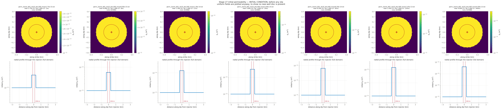

# CYCLE 2 Round 5 — kpmax SWEEP at the MEASURED tau_0 = 10.36 MPa, kpmin held at 1e-15. Contrast 2.75x (Taiyi's own, his zone being nearly uniform at 1.1e-12 / 4.0e-13) to 400x (his far-field over our kpmin), seven values log-spaced, bracketing the present 250x. kpmax has been 2.5e-13 in all ~90 runs of this project with no recorded justification, and it is constrained by pressure alone — which has since been recalibrated twice (7 runs)

**Nothing here has been submitted.** This is the pre-submittal check.

## Decks

| run | parent | **permev** | **sigmabar_0** | eta Pa·s | beta 1/Pa | phi | phi*beta | kpmax | kp=kpmin | perm field | injection | muinit | tau0 MPa | dp_crit MPa | tmax d |
|---|---|---|---|---|---|---|---|---|---|---|---|---|---|---|---|
| [633080](params_633080.txt) | 632960 | **T** | **27.99** | 1.27e-4 | 2.25e-8 | 0.01 | 2.250e-10 | 2.750e-15 | 1e-15 | perm_2zone_601_ds10_disc300_kmax2.75e-15.txt (3x) | `june_clean_from_d4300.txt` | 0.3700 | 10.36 | 10.73 | 13.10 |
| [633081](params_633081.txt) | 632960 | **T** | **27.99** | 1.27e-4 | 2.25e-8 | 0.01 | 2.250e-10 | 6.000e-15 | 1e-15 | perm_2zone_601_ds10_disc300_kmax6.00e-15.txt (6x) | `june_clean_from_d4300.txt` | 0.3700 | 10.36 | 10.73 | 13.10 |
| [633082](params_633082.txt) | 632960 | **T** | **27.99** | 1.27e-4 | 2.25e-8 | 0.01 | 2.250e-10 | 1.300e-14 | 1e-15 | perm_2zone_601_ds10_disc300_kmax1.30e-14.txt (13x) | `june_clean_from_d4300.txt` | 0.3700 | 10.36 | 10.73 | 13.10 |
| [633083](params_633083.txt) | 632960 | **T** | **27.99** | 1.27e-4 | 2.25e-8 | 0.01 | 2.250e-10 | 3.000e-14 | 1e-15 | perm_2zone_601_ds10_disc300_kmax3.00e-14.txt (30x) | `june_clean_from_d4300.txt` | 0.3700 | 10.36 | 10.73 | 13.10 |
| [633084](params_633084.txt) | 632960 | **T** | **27.99** | 1.27e-4 | 2.25e-8 | 0.01 | 2.250e-10 | 6.500e-14 | 1e-15 | perm_2zone_601_ds10_disc300_kmax6.50e-14.txt (65x) | `june_clean_from_d4300.txt` | 0.3700 | 10.36 | 10.73 | 13.10 |
| [633085](params_633085.txt) | 632960 | **T** | **27.99** | 1.27e-4 | 2.25e-8 | 0.01 | 2.250e-10 | 1.450e-13 | 1e-15 | perm_2zone_601_ds10_disc300_kmax1.45e-13.txt (145x) | `june_clean_from_d4300.txt` | 0.3700 | 10.36 | 10.73 | 13.10 |
| [633086](params_633086.txt) | 632960 | **T** | **27.99** | 1.27e-4 | 2.25e-8 | 0.01 | 2.250e-10 | 4.000e-13 | 1e-15 | perm_2zone_601_ds10_disc300_kmax4.00e-13.txt (400x) | `june_clean_from_d4300.txt` | 0.3700 | 10.36 | 10.73 | 13.10 |

## Derived hydraulics

| run | D near m²/s | D far m²/s | str=beta*phi | T at kpmin | T at kpmax | gamma(h=60s, kpmin) | gamma(h=60s, kpmax) |
|---|---|---|---|---|---|---|---|
| 633080 | 9.6238e-02 | 3.4996e-02 | 2.250e-10 | 1.590e-11 | 4.372e-11 | 0.8858 | 0.7383 |
| 633081 | 2.0997e-01 | 3.4996e-02 | 2.250e-10 | 1.590e-11 | 9.538e-11 | 0.8858 | 0.5639 |
| 633082 | 4.5494e-01 | 3.4996e-02 | 2.250e-10 | 1.590e-11 | 2.067e-10 | 0.8858 | 0.3738 |
| 633083 | 1.0499e+00 | 3.4996e-02 | 2.250e-10 | 1.590e-11 | 4.769e-10 | 0.8858 | 0.2055 |
| 633084 | 2.2747e+00 | 3.4996e-02 | 2.250e-10 | 1.590e-11 | 1.033e-09 | 0.8858 | 0.1066 |
| 633085 | 5.0744e+00 | 3.4996e-02 | 2.250e-10 | 1.590e-11 | 2.305e-09 | 0.8858 | 0.0508 |
| 633086 | 1.3998e+01 | 3.4996e-02 | 2.250e-10 | 1.590e-11 | 6.359e-09 | 0.8858 | 0.0190 |

`str`, `T` and `gamma` are the quantities `m_diffusion.f90` actually assembles (lines 444, 669, 671). `gamma` is the one a viscosity/compressibility trade does **not** hold fixed.

## Failure feasibility — can the fault slip at the OBSERVED pressure?

Peak **measured** downhole overpressure over these 13.10 d is **11.84 MPa** (p_wh + rho·g·H − P0, with rho·g·H = 40.0 and P0 = 73.8 MPa). Slip requires Δp > Δp_crit = σ̄₀(1 − μ₀/f₀). If Δp_crit exceeds 11.84 MPa the fault can only slip by **over-pressurising past the measurement**.

| run | μ₀ | Δp_crit MPa | vs measured | verdict |
|---|---|---|---|---|
| 633080 | 0.3700 | 10.73 | -1.11 | can fail |
| 633081 | 0.3700 | 10.73 | -1.11 | can fail |
| 633082 | 0.3700 | 10.73 | -1.11 | can fail |
| 633083 | 0.3700 | 10.73 | -1.11 | can fail |
| 633084 | 0.3700 | 10.73 | -1.11 | can fail |
| 633085 | 0.3700 | 10.73 | -1.11 | can fail |
| 633086 | 0.3700 | 10.73 | -1.11 | can fail |

**How understressed can the fault be and still fail at the observed pressure?** μ₀ ≥ f₀(1 − Δp_obs/σ̄₀):

| σ̄₀ MPa | minimum μ₀ | minimum τ₀ MPa | source of σ̄₀ |
|---|---|---|---|
| 27.99 | **0.3462** | **9.69** | derived from σ_v 100, σ_Hmax 160, dip 10°, p_pore 73.82 |

This stage runs μ₀ = 0.3700, comfortably above the floor above, so the fault can reach failure at the measured pressure without over-pressurising. Whether it then accumulates enough slip to build a front is a separate question that the friction law, not this inequality, decides — HBI's regularised rate-and-state law has no failure threshold, so Δp_crit is an orientation number here and not a prediction.

## Initial condition



## Deck diffs against parents

- [`res633080.in` vs `res632960.in`](diff_633080.txt)
- [`res633081.in` vs `res632960.in`](diff_633081.txt)
- [`res633082.in` vs `res632960.in`](diff_633082.txt)
- [`res633083.in` vs `res632960.in`](diff_633083.txt)
- [`res633084.in` vs `res632960.in`](diff_633084.txt)
- [`res633085.in` vs `res632960.in`](diff_633085.txt)
- [`res633086.in` vs `res632960.in`](diff_633086.txt)

## Launch commands, once approved

```bash
cd /home/groups/edunham/nberrios/3dhbi/examples/grid_search_inputs
sbatch march26_submit_hbi_git_scratch.sh -i res633080.in -w june_clean.txt -p perm_2zone_601_ds10_disc300_kmax2.75e-15.txt
sbatch march26_submit_hbi_git_scratch.sh -i res633081.in -w june_clean.txt -p perm_2zone_601_ds10_disc300_kmax6.00e-15.txt
sbatch march26_submit_hbi_git_scratch.sh -i res633082.in -w june_clean.txt -p perm_2zone_601_ds10_disc300_kmax1.30e-14.txt
sbatch march26_submit_hbi_git_scratch.sh -i res633083.in -w june_clean.txt -p perm_2zone_601_ds10_disc300_kmax3.00e-14.txt
sbatch march26_submit_hbi_git_scratch.sh -i res633084.in -w june_clean.txt -p perm_2zone_601_ds10_disc300_kmax6.50e-14.txt
sbatch march26_submit_hbi_git_scratch.sh -i res633085.in -w june_clean.txt -p perm_2zone_601_ds10_disc300_kmax1.45e-13.txt
sbatch march26_submit_hbi_git_scratch.sh -i res633086.in -w june_clean.txt -p perm_2zone_601_ds10_disc300_kmax4.00e-13.txt
```
