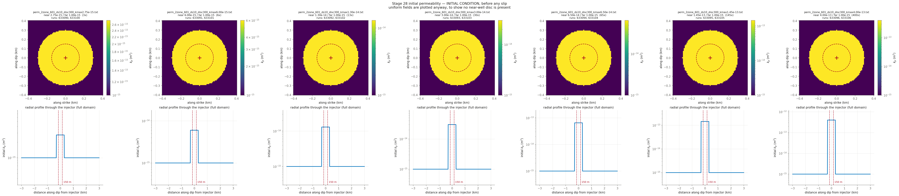

# CYCLE 2 Round 5b — the kpmax sweep at the next two stress states, tau_0 = 11.53 and 12.71 MPa, kpmin held. Same seven contrasts (2.75x to 400x). kpmax behaves OPPOSITELY to the disc radius as stress rises: the disc sets where kp starts high, kpmax sets the ceiling permev grows toward, so it matters MORE where the disc matters less. 11.53 tests how robust the best joint cell is to a parameter with no recorded justification; 12.71 is where dp crosses zero on the disc sweep (14 runs)

**Nothing here has been submitted.** This is the pre-submittal check.

## Decks

| run | parent | **permev** | **sigmabar_0** | eta Pa·s | beta 1/Pa | phi | phi*beta | kpmax | kp=kpmin | perm field | injection | muinit | tau0 MPa | dp_crit MPa | tmax d |
|---|---|---|---|---|---|---|---|---|---|---|---|---|---|---|---|
| [633090](params_633090.txt) | 632961 | **T** | **27.99** | 1.27e-4 | 2.25e-8 | 0.01 | 2.250e-10 | 2.750e-15 | 1e-15 | perm_2zone_601_ds10_disc300_kmax2.75e-15.txt (3x) | `june_clean_from_d4300.txt` | 0.4120 | 11.53 | 8.77 | 13.10 |
| [633091](params_633091.txt) | 632961 | **T** | **27.99** | 1.27e-4 | 2.25e-8 | 0.01 | 2.250e-10 | 6.000e-15 | 1e-15 | perm_2zone_601_ds10_disc300_kmax6.00e-15.txt (6x) | `june_clean_from_d4300.txt` | 0.4120 | 11.53 | 8.77 | 13.10 |
| [633092](params_633092.txt) | 632961 | **T** | **27.99** | 1.27e-4 | 2.25e-8 | 0.01 | 2.250e-10 | 1.300e-14 | 1e-15 | perm_2zone_601_ds10_disc300_kmax1.30e-14.txt (13x) | `june_clean_from_d4300.txt` | 0.4120 | 11.53 | 8.77 | 13.10 |
| [633093](params_633093.txt) | 632961 | **T** | **27.99** | 1.27e-4 | 2.25e-8 | 0.01 | 2.250e-10 | 3.000e-14 | 1e-15 | perm_2zone_601_ds10_disc300_kmax3.00e-14.txt (30x) | `june_clean_from_d4300.txt` | 0.4120 | 11.53 | 8.77 | 13.10 |
| [633094](params_633094.txt) | 632961 | **T** | **27.99** | 1.27e-4 | 2.25e-8 | 0.01 | 2.250e-10 | 6.500e-14 | 1e-15 | perm_2zone_601_ds10_disc300_kmax6.50e-14.txt (65x) | `june_clean_from_d4300.txt` | 0.4120 | 11.53 | 8.77 | 13.10 |
| [633095](params_633095.txt) | 632961 | **T** | **27.99** | 1.27e-4 | 2.25e-8 | 0.01 | 2.250e-10 | 1.450e-13 | 1e-15 | perm_2zone_601_ds10_disc300_kmax1.45e-13.txt (145x) | `june_clean_from_d4300.txt` | 0.4120 | 11.53 | 8.77 | 13.10 |
| [633096](params_633096.txt) | 632961 | **T** | **27.99** | 1.27e-4 | 2.25e-8 | 0.01 | 2.250e-10 | 4.000e-13 | 1e-15 | perm_2zone_601_ds10_disc300_kmax4.00e-13.txt (400x) | `june_clean_from_d4300.txt` | 0.4120 | 11.53 | 8.77 | 13.10 |
| [633100](params_633100.txt) | 632962 | **T** | **27.99** | 1.27e-4 | 2.25e-8 | 0.01 | 2.250e-10 | 2.750e-15 | 1e-15 | perm_2zone_601_ds10_disc300_kmax2.75e-15.txt (3x) | `june_clean_from_d4300.txt` | 0.4540 | 12.71 | 6.81 | 13.10 |
| [633101](params_633101.txt) | 632962 | **T** | **27.99** | 1.27e-4 | 2.25e-8 | 0.01 | 2.250e-10 | 6.000e-15 | 1e-15 | perm_2zone_601_ds10_disc300_kmax6.00e-15.txt (6x) | `june_clean_from_d4300.txt` | 0.4540 | 12.71 | 6.81 | 13.10 |
| [633102](params_633102.txt) | 632962 | **T** | **27.99** | 1.27e-4 | 2.25e-8 | 0.01 | 2.250e-10 | 1.300e-14 | 1e-15 | perm_2zone_601_ds10_disc300_kmax1.30e-14.txt (13x) | `june_clean_from_d4300.txt` | 0.4540 | 12.71 | 6.81 | 13.10 |
| [633103](params_633103.txt) | 632962 | **T** | **27.99** | 1.27e-4 | 2.25e-8 | 0.01 | 2.250e-10 | 3.000e-14 | 1e-15 | perm_2zone_601_ds10_disc300_kmax3.00e-14.txt (30x) | `june_clean_from_d4300.txt` | 0.4540 | 12.71 | 6.81 | 13.10 |
| [633104](params_633104.txt) | 632962 | **T** | **27.99** | 1.27e-4 | 2.25e-8 | 0.01 | 2.250e-10 | 6.500e-14 | 1e-15 | perm_2zone_601_ds10_disc300_kmax6.50e-14.txt (65x) | `june_clean_from_d4300.txt` | 0.4540 | 12.71 | 6.81 | 13.10 |
| [633105](params_633105.txt) | 632962 | **T** | **27.99** | 1.27e-4 | 2.25e-8 | 0.01 | 2.250e-10 | 1.450e-13 | 1e-15 | perm_2zone_601_ds10_disc300_kmax1.45e-13.txt (145x) | `june_clean_from_d4300.txt` | 0.4540 | 12.71 | 6.81 | 13.10 |
| [633106](params_633106.txt) | 632962 | **T** | **27.99** | 1.27e-4 | 2.25e-8 | 0.01 | 2.250e-10 | 4.000e-13 | 1e-15 | perm_2zone_601_ds10_disc300_kmax4.00e-13.txt (400x) | `june_clean_from_d4300.txt` | 0.4540 | 12.71 | 6.81 | 13.10 |

## Derived hydraulics

| run | D near m²/s | D far m²/s | str=beta*phi | T at kpmin | T at kpmax | gamma(h=60s, kpmin) | gamma(h=60s, kpmax) |
|---|---|---|---|---|---|---|---|
| 633090 | 9.6238e-02 | 3.4996e-02 | 2.250e-10 | 1.590e-11 | 4.372e-11 | 0.8858 | 0.7383 |
| 633091 | 2.0997e-01 | 3.4996e-02 | 2.250e-10 | 1.590e-11 | 9.538e-11 | 0.8858 | 0.5639 |
| 633092 | 4.5494e-01 | 3.4996e-02 | 2.250e-10 | 1.590e-11 | 2.067e-10 | 0.8858 | 0.3738 |
| 633093 | 1.0499e+00 | 3.4996e-02 | 2.250e-10 | 1.590e-11 | 4.769e-10 | 0.8858 | 0.2055 |
| 633094 | 2.2747e+00 | 3.4996e-02 | 2.250e-10 | 1.590e-11 | 1.033e-09 | 0.8858 | 0.1066 |
| 633095 | 5.0744e+00 | 3.4996e-02 | 2.250e-10 | 1.590e-11 | 2.305e-09 | 0.8858 | 0.0508 |
| 633096 | 1.3998e+01 | 3.4996e-02 | 2.250e-10 | 1.590e-11 | 6.359e-09 | 0.8858 | 0.0190 |
| 633100 | 9.6238e-02 | 3.4996e-02 | 2.250e-10 | 1.590e-11 | 4.372e-11 | 0.8858 | 0.7383 |
| 633101 | 2.0997e-01 | 3.4996e-02 | 2.250e-10 | 1.590e-11 | 9.538e-11 | 0.8858 | 0.5639 |
| 633102 | 4.5494e-01 | 3.4996e-02 | 2.250e-10 | 1.590e-11 | 2.067e-10 | 0.8858 | 0.3738 |
| 633103 | 1.0499e+00 | 3.4996e-02 | 2.250e-10 | 1.590e-11 | 4.769e-10 | 0.8858 | 0.2055 |
| 633104 | 2.2747e+00 | 3.4996e-02 | 2.250e-10 | 1.590e-11 | 1.033e-09 | 0.8858 | 0.1066 |
| 633105 | 5.0744e+00 | 3.4996e-02 | 2.250e-10 | 1.590e-11 | 2.305e-09 | 0.8858 | 0.0508 |
| 633106 | 1.3998e+01 | 3.4996e-02 | 2.250e-10 | 1.590e-11 | 6.359e-09 | 0.8858 | 0.0190 |

`str`, `T` and `gamma` are the quantities `m_diffusion.f90` actually assembles (lines 444, 669, 671). `gamma` is the one a viscosity/compressibility trade does **not** hold fixed.

## Failure feasibility — can the fault slip at the OBSERVED pressure?

Peak **measured** downhole overpressure over these 13.10 d is **11.84 MPa** (p_wh + rho·g·H − P0, with rho·g·H = 40.0 and P0 = 73.8 MPa). Slip requires Δp > Δp_crit = σ̄₀(1 − μ₀/f₀). If Δp_crit exceeds 11.84 MPa the fault can only slip by **over-pressurising past the measurement**.

| run | μ₀ | Δp_crit MPa | vs measured | verdict |
|---|---|---|---|---|
| 633090 | 0.4120 | 8.77 | -3.07 | can fail |
| 633091 | 0.4120 | 8.77 | -3.07 | can fail |
| 633092 | 0.4120 | 8.77 | -3.07 | can fail |
| 633093 | 0.4120 | 8.77 | -3.07 | can fail |
| 633094 | 0.4120 | 8.77 | -3.07 | can fail |
| 633095 | 0.4120 | 8.77 | -3.07 | can fail |
| 633096 | 0.4120 | 8.77 | -3.07 | can fail |
| 633100 | 0.4540 | 6.81 | -5.03 | can fail |
| 633101 | 0.4540 | 6.81 | -5.03 | can fail |
| 633102 | 0.4540 | 6.81 | -5.03 | can fail |
| 633103 | 0.4540 | 6.81 | -5.03 | can fail |
| 633104 | 0.4540 | 6.81 | -5.03 | can fail |
| 633105 | 0.4540 | 6.81 | -5.03 | can fail |
| 633106 | 0.4540 | 6.81 | -5.03 | can fail |

**How understressed can the fault be and still fail at the observed pressure?** μ₀ ≥ f₀(1 − Δp_obs/σ̄₀):

| σ̄₀ MPa | minimum μ₀ | minimum τ₀ MPa | source of σ̄₀ |
|---|---|---|---|
| 27.99 | **0.3462** | **9.69** | derived from σ_v 100, σ_Hmax 160, dip 10°, p_pore 73.82 |

This stage runs μ₀ = 0.4120, 0.4540, comfortably above the floor above, so the fault can reach failure at the measured pressure without over-pressurising. Whether it then accumulates enough slip to build a front is a separate question that the friction law, not this inequality, decides — HBI's regularised rate-and-state law has no failure threshold, so Δp_crit is an orientation number here and not a prediction.

## Initial condition



## Deck diffs against parents

- [`res633090.in` vs `res632961.in`](diff_633090.txt)
- [`res633091.in` vs `res632961.in`](diff_633091.txt)
- [`res633092.in` vs `res632961.in`](diff_633092.txt)
- [`res633093.in` vs `res632961.in`](diff_633093.txt)
- [`res633094.in` vs `res632961.in`](diff_633094.txt)
- [`res633095.in` vs `res632961.in`](diff_633095.txt)
- [`res633096.in` vs `res632961.in`](diff_633096.txt)
- [`res633100.in` vs `res632962.in`](diff_633100.txt)
- [`res633101.in` vs `res632962.in`](diff_633101.txt)
- [`res633102.in` vs `res632962.in`](diff_633102.txt)
- [`res633103.in` vs `res632962.in`](diff_633103.txt)
- [`res633104.in` vs `res632962.in`](diff_633104.txt)
- [`res633105.in` vs `res632962.in`](diff_633105.txt)
- [`res633106.in` vs `res632962.in`](diff_633106.txt)

## Launch commands, once approved

```bash
cd /home/groups/edunham/nberrios/3dhbi/examples/grid_search_inputs
sbatch march26_submit_hbi_git_scratch.sh -i res633090.in -w june_clean.txt -p perm_2zone_601_ds10_disc300_kmax2.75e-15.txt
sbatch march26_submit_hbi_git_scratch.sh -i res633091.in -w june_clean.txt -p perm_2zone_601_ds10_disc300_kmax6.00e-15.txt
sbatch march26_submit_hbi_git_scratch.sh -i res633092.in -w june_clean.txt -p perm_2zone_601_ds10_disc300_kmax1.30e-14.txt
sbatch march26_submit_hbi_git_scratch.sh -i res633093.in -w june_clean.txt -p perm_2zone_601_ds10_disc300_kmax3.00e-14.txt
sbatch march26_submit_hbi_git_scratch.sh -i res633094.in -w june_clean.txt -p perm_2zone_601_ds10_disc300_kmax6.50e-14.txt
sbatch march26_submit_hbi_git_scratch.sh -i res633095.in -w june_clean.txt -p perm_2zone_601_ds10_disc300_kmax1.45e-13.txt
sbatch march26_submit_hbi_git_scratch.sh -i res633096.in -w june_clean.txt -p perm_2zone_601_ds10_disc300_kmax4.00e-13.txt
sbatch march26_submit_hbi_git_scratch.sh -i res633100.in -w june_clean.txt -p perm_2zone_601_ds10_disc300_kmax2.75e-15.txt
sbatch march26_submit_hbi_git_scratch.sh -i res633101.in -w june_clean.txt -p perm_2zone_601_ds10_disc300_kmax6.00e-15.txt
sbatch march26_submit_hbi_git_scratch.sh -i res633102.in -w june_clean.txt -p perm_2zone_601_ds10_disc300_kmax1.30e-14.txt
sbatch march26_submit_hbi_git_scratch.sh -i res633103.in -w june_clean.txt -p perm_2zone_601_ds10_disc300_kmax3.00e-14.txt
sbatch march26_submit_hbi_git_scratch.sh -i res633104.in -w june_clean.txt -p perm_2zone_601_ds10_disc300_kmax6.50e-14.txt
sbatch march26_submit_hbi_git_scratch.sh -i res633105.in -w june_clean.txt -p perm_2zone_601_ds10_disc300_kmax1.45e-13.txt
sbatch march26_submit_hbi_git_scratch.sh -i res633106.in -w june_clean.txt -p perm_2zone_601_ds10_disc300_kmax4.00e-13.txt
```
