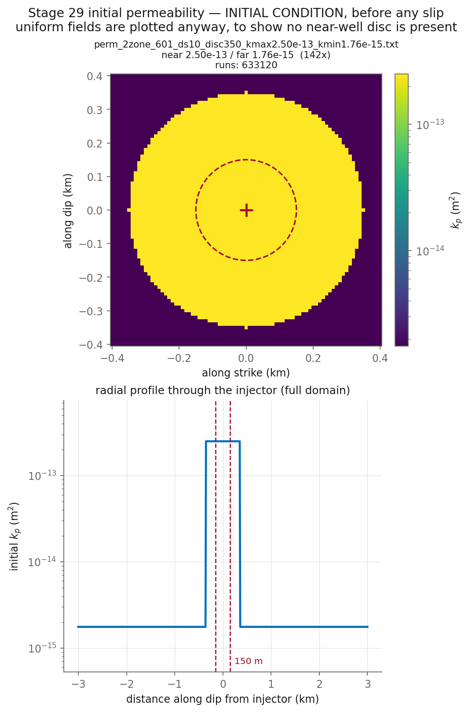

# CYCLE 2 Round 7 — permeability EVOLUTION OFF, background raised 1.76x so static diffusion carries the front. 633001 matches the wellhead plateau to +2.4% then misses the day-9 step: across it the observed dp rises +4.64 MPa and the model +1.68, and from 9.6 to 12.5 d the rate FALLS 44.5->37.8 L/s while the observed dp RISES 14.63->16.29 and the model's FALLS 14.80->13.44. Measured, the well is LINEAR (dp/q 439 then 431 kPa per L/s across a 1.4x rate change) and the model is not (443 then 355). The cause is the mechanism that makes the front: inside the disc kp already starts AT kpmax, so the softening is the enhanced ZONE growing, which is also what propagates the front -- so kL cannot separate them. A closed compartment was tested and rejected (d(dp)/dV 0.015 / 1.13 / -0.24 MPa/ML over 4-8 / 8-10 / 10-12.6 d). This takes the front from a static background instead: the observed 763.1 m at 8.7 d needs D = 0.0616 m2/s, i.e. kp 1.76e-15 against the present 1.0e-15. Disc unchanged at 2.5e-13. permev F makes the kpmin key inert (main_LH.f90:2413), so the background is in the MAP; the map is applied at :864-886, outside every permev gate, so the disc survives (1 run)

**Nothing here has been submitted.** This is the pre-submittal check.

## Decks

| run | parent | **permev** | **sigmabar_0** | eta Pa·s | beta 1/Pa | phi | phi*beta | kpmax | kp=kpmin | perm field | injection | muinit | tau0 MPa | dp_crit MPa | tmax d |
|---|---|---|---|---|---|---|---|---|---|---|---|---|---|---|---|
| [633120](params_633120.txt) | 633001 | **F** | **27.99** | 1.27e-4 | 2.25e-8 | 0.01 | 2.250e-10 | 2.5e-13 | 1.76e-15 | perm_2zone_601_ds10_disc350_kmax2.50e-13_kmin1.76e-15.txt (142x) | `june_clean_from_d4300.txt` | 0.4120 | 11.53 | 8.77 | 13.10 |

## Derived hydraulics

| run | D near m²/s | D far m²/s | str=beta*phi | T at kpmin | T at kpmax | gamma(h=60s, kpmin) | gamma(h=60s, kpmax) |
|---|---|---|---|---|---|---|---|
| 633120 | 8.7489e+00 | 6.1592e-02 | 2.250e-10 | 2.798e-11 | 3.974e-09 | 0.8151 | 0.0301 |

`str`, `T` and `gamma` are the quantities `m_diffusion.f90` actually assembles (lines 444, 669, 671). `gamma` is the one a viscosity/compressibility trade does **not** hold fixed.

## Failure feasibility — can the fault slip at the OBSERVED pressure?

Peak **measured** downhole overpressure over these 13.10 d is **11.84 MPa** (p_wh + rho·g·H − P0, with rho·g·H = 40.0 and P0 = 73.8 MPa). Slip requires Δp > Δp_crit = σ̄₀(1 − μ₀/f₀). If Δp_crit exceeds 11.84 MPa the fault can only slip by **over-pressurising past the measurement**.

| run | μ₀ | Δp_crit MPa | vs measured | verdict |
|---|---|---|---|---|
| 633120 | 0.4120 | 8.77 | -3.07 | can fail |

**How understressed can the fault be and still fail at the observed pressure?** μ₀ ≥ f₀(1 − Δp_obs/σ̄₀):

| σ̄₀ MPa | minimum μ₀ | minimum τ₀ MPa | source of σ̄₀ |
|---|---|---|---|
| 27.99 | **0.3462** | **9.69** | derived from σ_v 100, σ_Hmax 160, dip 10°, p_pore 73.82 |

This stage runs μ₀ = 0.4120, comfortably above the floor above, so the fault can reach failure at the measured pressure without over-pressurising. Whether it then accumulates enough slip to build a front is a separate question that the friction law, not this inequality, decides — HBI's regularised rate-and-state law has no failure threshold, so Δp_crit is an orientation number here and not a prediction.

## Initial condition



## Deck diffs against parents

- [`res633120.in` vs `res633001.in`](diff_633120.txt)

## Launch commands, once approved

```bash
cd /home/groups/edunham/nberrios/3dhbi/examples/grid_search_inputs
sbatch march26_submit_hbi_git_scratch.sh -i res633120.in -w june_clean.txt -p perm_2zone_601_ds10_disc350_kmax2.50e-13_kmin1.76e-15.txt
```
