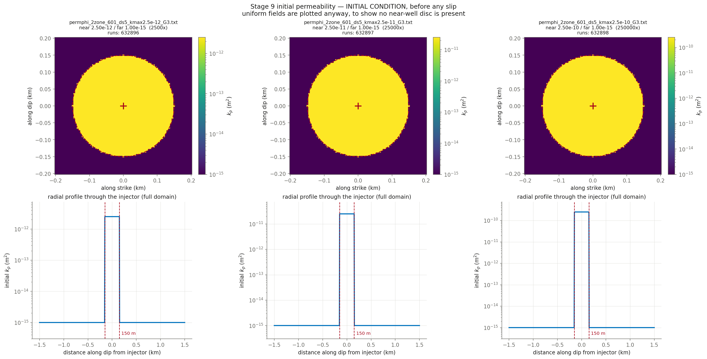

# Stage 9 — kpmax raised 10x/100x/1000x on 632875, the one configuration whose front matches (3 runs)

**Nothing here has been submitted.** This is the pre-submittal check.

## Decks

| run | parent | **permev** | **sigmabar_0** | eta Pa·s | beta 1/Pa | phi | phi*beta | kpmax | kp=kpmin | perm field | injection | muinit | tau0 MPa | dp_crit MPa | tmax d |
|---|---|---|---|---|---|---|---|---|---|---|---|---|---|---|---|
| [632896](params_632896.txt) | 632875 | **T** | **27.99** | 0.89e-3 | 2.25e-8 | 0.01 | 2.250e-10 | 2.5e-12 | 1e-15 | permphi_2zone_601_ds5_kmax2.5e-12_G3.txt (2500x) | `june_clean.txt` | 0.37 | 10.36 | 10.73 | 5.00 |
| [632897](params_632897.txt) | 632875 | **T** | **27.99** | 0.89e-3 | 2.25e-8 | 0.01 | 2.250e-10 | 2.5e-11 | 1e-15 | permphi_2zone_601_ds5_kmax2.5e-11_G3.txt (25000x) | `june_clean.txt` | 0.37 | 10.36 | 10.73 | 5.00 |
| [632898](params_632898.txt) | 632875 | **T** | **27.99** | 0.89e-3 | 2.25e-8 | 0.01 | 2.250e-10 | 2.5e-10 | 1e-15 | permphi_2zone_601_ds5_kmax2.5e-10_G3.txt (250000x) | `june_clean.txt` | 0.37 | 10.36 | 10.73 | 5.00 |

## Derived hydraulics

| run | D near m²/s | D far m²/s | str=beta*phi | T at kpmin | T at kpmax | gamma(h=60s, kpmin) | gamma(h=60s, kpmax) |
|---|---|---|---|---|---|---|---|
| 632896 | 1.2484e+01 | 4.9938e-03 | 2.250e-10 | 2.918e-12 | 7.296e-09 | 0.9769 | 0.0166 |
| 632897 | 1.2484e+02 | 4.9938e-03 | 2.250e-10 | 2.918e-12 | 7.296e-08 | 0.9769 | 0.0017 |
| 632898 | 1.2484e+03 | 4.9938e-03 | 2.250e-10 | 2.918e-12 | 7.296e-07 | 0.9769 | 0.0002 |

`str`, `T` and `gamma` are the quantities `m_diffusion.f90` actually assembles (lines 444, 669, 671). `gamma` is the one a viscosity/compressibility trade does **not** hold fixed.

## Failure feasibility — can the fault slip at the OBSERVED pressure?

Peak **measured** downhole overpressure over these 5.00 d is **10.92 MPa** (p_wh + rho·g·H − P0, with rho·g·H = 40.0 and P0 = 73.8 MPa). Slip requires Δp > Δp_crit = σ̄₀(1 − μ₀/f₀). If Δp_crit exceeds 10.92 MPa the fault can only slip by **over-pressurising past the measurement**.

| run | μ₀ | Δp_crit MPa | vs measured | verdict |
|---|---|---|---|---|
| 632896 | 0.37 | 10.73 | -0.19 | can fail |
| 632897 | 0.37 | 10.73 | -0.19 | can fail |
| 632898 | 0.37 | 10.73 | -0.19 | can fail |

**How understressed can the fault be and still fail at the observed pressure?** μ₀ ≥ f₀(1 − Δp_obs/σ̄₀):

| σ̄₀ MPa | minimum μ₀ | minimum τ₀ MPa | source of σ̄₀ |
|---|---|---|---|
| 27.99 | **0.3659** | **10.24** | derived from σ_v 100, σ_Hmax 160, dip 10°, p_pore 73.82 |

This stage runs μ₀ = 0.3700, comfortably above the floor above, so the fault can reach failure at the measured pressure without over-pressurising. Whether it then accumulates enough slip to build a front is a separate question that the friction law, not this inequality, decides — HBI's regularised rate-and-state law has no failure threshold, so Δp_crit is an orientation number here and not a prediction.

## Initial condition



## Deck diffs against parents

- [`res632896.in` vs `res632875.in`](diff_632896.txt)
- [`res632897.in` vs `res632875.in`](diff_632897.txt)
- [`res632898.in` vs `res632875.in`](diff_632898.txt)

## Launch commands, once approved

```bash
cd /home/groups/edunham/nberrios/3dhbi/examples/grid_search_inputs
sbatch march26_submit_hbi_git_scratch.sh -i res632896.in -w june_clean.txt -p permphi_2zone_601_ds5_kmax2.5e-12_G3.txt
sbatch march26_submit_hbi_git_scratch.sh -i res632897.in -w june_clean.txt -p permphi_2zone_601_ds5_kmax2.5e-11_G3.txt
sbatch march26_submit_hbi_git_scratch.sh -i res632898.in -w june_clean.txt -p permphi_2zone_601_ds5_kmax2.5e-10_G3.txt
```
